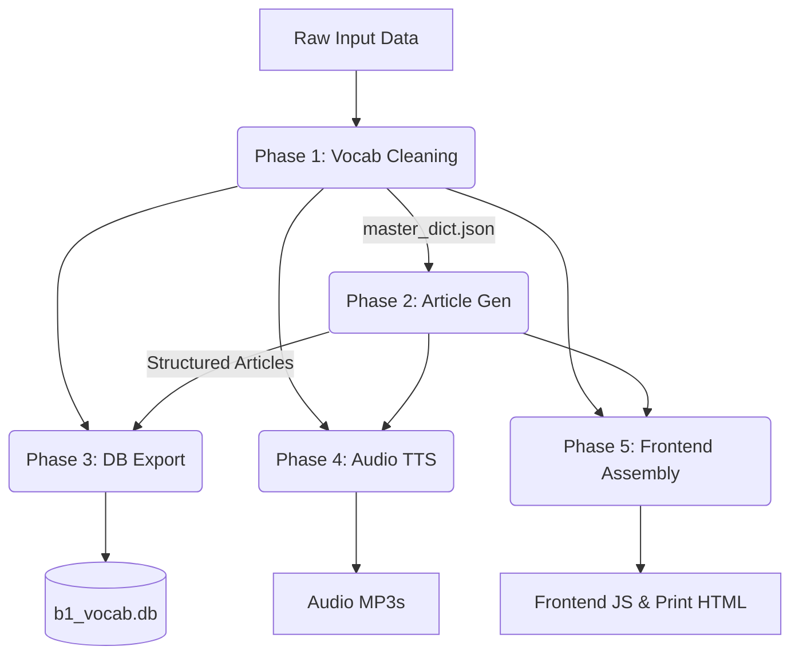

# Data Pipeline Master Document (V2)

## 1. Pipeline Philosophy
The fundamental philosophy of this language learning data pipeline is: **"Correct, non-repetitive, minimized data flow."** 

We prioritize a structured, data-driven architecture. Hardcoded assumptions are avoided. Instead, parameters like `source_level` dictate downstream behavior. The system utilizes JSON as the primary interchange format to maintain rich metadata (like character-level UI highlighting indices) that plain text cannot support.

## 2. Global Parameters & State

The entire pipeline is governed by a set of global parameters. These parameters are injected at Phase 1 and inherited by all subsequent phases.

*   `source_level`: **"B1"** (Strictly dictates CEFR B1 / SFI D standard for article generation)
*   `native_language`: **"English"** (Bridge language for translation)
*   `course_id`: **"sfid"** (Namespace for the database and frontend)

## 3. The 5-Phase Architecture

The pipeline consists of 5 strictly ordered phases. Phase 1 must complete fully before Phase 2 begins, as the accuracy of the vocabulary dictates the quality of the generated articles.

### Phase 1: Vocabulary Extraction, Cleaning & Dictionary Generation
- **Goal**: Clean raw input (specifically `b1_ordlista.json` for this project, though wordlists and text are supported) and create a pristine dictionary.
- **Rules**: Fix soft-hyphens, remove grammar info, fix phrasal verbs, remove PDF artifacts.
- **Output**: `master_dict.json`
- **Link**: [SPEC_01_VOCAB_CLEANING.md](./SPEC_01_VOCAB_CLEANING.md)

### Phase 2: Structured Article Generation
- **Goal**: Generate CEFR B1 (SFI D) level Swedish articles incorporating 100% of the target vocabulary.
- **Rules**: Semantic grouping, 3-layer architecture (`Course` -> `Stage` -> `Article`), strict JSON character index mapping.
- **Output**: `chapters/*.json`
- **Link**: [SPEC_02_ARTICLE_GENERATION.md](./SPEC_02_ARTICLE_GENERATION.md)

### Phase 3: Database Export (SQLite)
- **Goal**: Join the clean vocabulary with the generated contextual sentences.
- **Rules**: SQLite format, extract only "primary appearance" context sentences. Upsert on conflict.
- **Output**: `courses/sfid/b1_vocab.db`
- **Link**: [SPEC_03_DATABASE_EXPORT.md](./SPEC_03_DATABASE_EXPORT.md)

### Phase 4: Audio TTS Generation & Verification
- **Goal**: Generate and verify MP3 files for words and sentences.
- **Rules**: Edge TTS (-20% rate), OpenAI Whisper loopback verification (WER/Levenshtein).
- **Output**: `words_audio/`, `sentences_audio/`, `audio_manifest.json`
- **Link**: [SPEC_04_AUDIO_TTS.md](./SPEC_04_AUDIO_TTS.md)

### Phase 5: Frontend Data Assembly & HTML Printing
- **Goal**: Compile data for the static web app and physical printouts.
- **Rules**: Generate `global_dict.js` (flat KV) and `data.js` (nested layers). Generate A4 printable HTML.
- **Output**: `frontend/js/`, `print/sfid_b1_articles.html`
- **Link**: [SPEC_05_FRONTEND_INTEGRATION.md](./SPEC_05_FRONTEND_INTEGRATION.md)

## 4. Phase Isolation & Reporting Protocol

Every phase must strictly adhere to the following isolation and reporting requirements:

1. **Independent Output Directory**: Each phase must generate its own independent folder (e.g., `course/sfid/phase1/`, `course/sfid/phase2/`). All products, intermediate files, and logs for that phase must be saved exclusively within this independent folder.
2. **Phase Report File**: At the conclusion of each phase, a detailed report file (e.g., `phase1_report.md`) must be generated within that phase's folder. 
3. **Report Content**: The report must contain exhaustive statistics and details of all modifications made during the phase, especially focusing on changed parts and items that require special elaboration. For example:
    *   **Phase 1**: Detailed list of all modified/repaired words, the original defective string, and the final corrected word.
    *   **Phase 2**: The total number of articles generated, the distribution of topics, the word distribution across articles, and the final vocabulary coverage rate (must be 100%).
    *   **Phase 3-5**: Generation counts, success/failure rates, and deployment metrics.

This report serves as the final audit document for the phase's execution.

## 5. Execution Protocol
This pipeline should be orchestrated by a master Python script (e.g., `build_course.py`) that strictly enforces the execution order and validates the outputs of each phase before proceeding to the next.
