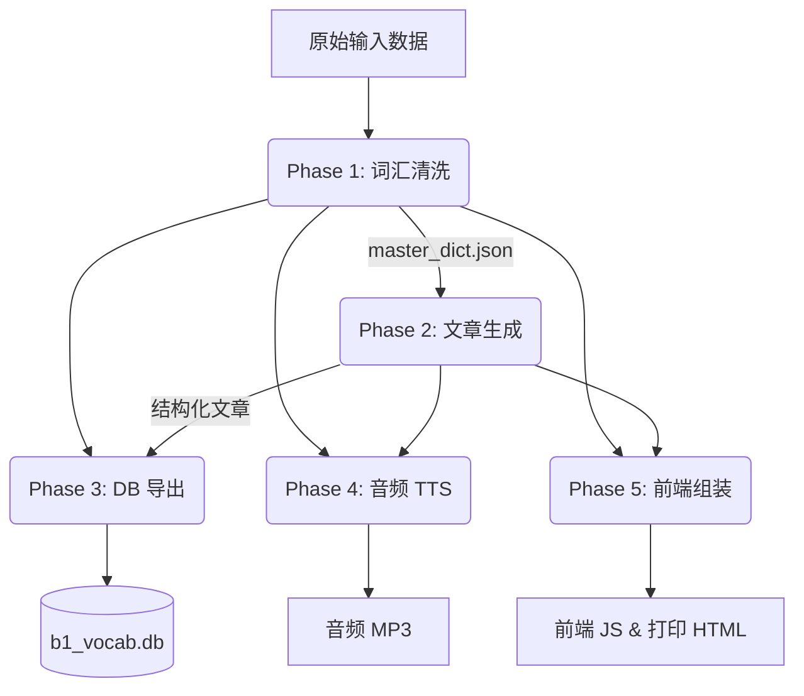

# 数据管线主文档 (V2)

## 1. 管线理念
此语言学习数据管线的基本理念是：**“正确、无重复、最小化数据流。”**

我们优先采用结构化、数据驱动的架构。避免使用硬编码的假设。相反，通过注入诸如 `source_level` 等参数来决定下游行为。系统使用 JSON 作为主要的数据交换格式，以保留纯文本无法支持的丰富元数据（例如字符级别的 UI 高亮索引）。

## 2. 全局参数与状态

整个管线由一组全局参数控制。这些参数在 Phase 1 注入，并被所有后续阶段继承。

*   `source_level`: **"B1"** (严格限定文章生成的标准为 CEFR B1 / SFI D)
*   `native_language`: **"English"** (用于翻译的桥梁语言)
*   `course_id`: **"sfid"** (用于数据库和前端的命名空间)

## 3. 五阶段架构

管线由 5 个严格排序的阶段组成。Phase 1 必须在 Phase 2 开始前完全结束，因为词汇的准确性直接决定了生成文章的质量。

### Phase 1: 词汇提取、清洗与词典生成
- **目标**: 清洗原始输入（本项目中特指 `b1_ordlista.json`，但也支持生词表或文本），并创建一个纯净的词典。
- **规则**: 修复软连字符、移除语法信息、修复短语动词、移除 PDF 伪影。
- **输出**: `master_dict.json`
- **链接**: [SPEC_01_VOCAB_CLEANING_ZH.md](./SPEC_01_VOCAB_CLEANING_ZH.md)

### Phase 2: 结构化文章生成
- **目标**: 生成 100% 包含目标词汇的 CEFR B1 (SFI D) 级别瑞典语文章。
- **规则**: 语义分组、三层架构 (`Course` -> `Step` -> `Article`)、严格的 JSON 字符索引映射。
- **输出**: `chapters/*.json`
- **链接**: [SPEC_02_ARTICLE_GENERATION_ZH.md](./SPEC_02_ARTICLE_GENERATION_ZH.md)

### Phase 3: 数据库导出 (SQLite)
- **目标**: 将干净的词汇与生成的上下文句子结合起来。
- **规则**: SQLite 格式，仅提取“主出场 (primary appearance)”上下文句子。冲突时执行 Upsert (更新)。
- **输出**: `courses/sfid/b1_vocab.db`
- **链接**: [SPEC_03_DATABASE_EXPORT_ZH.md](./SPEC_03_DATABASE_EXPORT_ZH.md)

### Phase 4: 音频 TTS 生成与校验
- **目标**: 为单词和句子生成并校验 MP3 文件。
- **规则**: Edge TTS (降低 20% 语速)、OpenAI Whisper 闭环校验 (WER/Levenshtein)。
- **输出**: `words_audio/`, `sentences_audio/`, `audio_manifest.json`
- **链接**: [SPEC_04_AUDIO_TTS_ZH.md](./SPEC_04_AUDIO_TTS_ZH.md)

### Phase 5: 前端数据组装与 HTML 打印
- **目标**: 编译用于静态 Web 应用和物理打印的数据。
- **规则**: 生成 `global_dict.js` (扁平键值对) 和 `data.js` (嵌套层级)。生成 A4 可打印 HTML。
- **输出**: `frontend/js/`, `print/sfid_b1_articles.html`
- **链接**: [SPEC_05_FRONTEND_INTEGRATION_ZH.md](./SPEC_05_FRONTEND_INTEGRATION_ZH.md)

## 4. 执行协议
此管线应由一个主 Python 脚本（例如 `build_course.py`）进行编排，该脚本负责严格执行顺序，并在进入下一阶段前验证各个阶段的输出结果。
