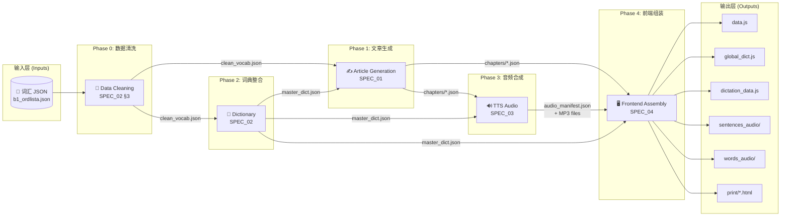
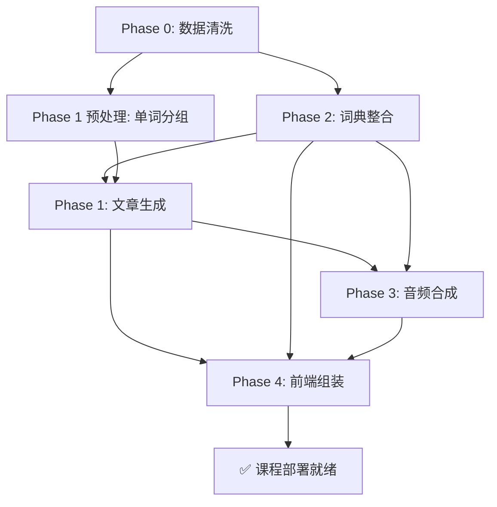

# 语言学习数据管线 V2 — 全局技术总纲

> **致所有接手本项目的 AI 助手与开发人员：**
> 本文档是整个"语言学习内容自动化生产系统"的**最顶层全局导航文件**。它定义了从一个原始词汇 JSON 文件到一套完整的、可部署的语言学习课程（含文章、词典、音频、前端数据）的端到端数据流水线。
>
> 每个阶段都有独立的、详尽的技术规范文档（SPEC 文件），本文档负责将它们**串联**起来，阐明彼此的依赖关系与数据流向。

---

## 1. 系统全局架构 (System Architecture)



---

## 2. 阶段概览与依赖关系 (Phase Overview & Dependencies)

| 阶段 | 名称 | 规范文件 | 输入 | 输出 | 前置依赖 |
|:---:|---|---|---|---|---|
| **Phase 0** | 数据清洗 | SPEC_02 §3-4 | 原始 `*_ordlista.json` | `clean_vocab.json` | 无 |
| **Phase 1** | 文章生成 | [SPEC_01](file://~/Developer/antigravity/Language%20learner/docs/SPEC_01_ARTICLE_GENERATION.md) | `clean_vocab.json`, `master_dict.json` | `chapters/*.json` | Phase 0, Phase 2 |
| **Phase 2** | 词典整合 | [SPEC_02](file://~/Developer/antigravity/Language%20learner/docs/SPEC_02_DICTIONARY_TRANSLATION.md) | 原始 `*_ordlista.json` + `ok_*.json` | `master_dict.json`, `global_dict.js` | Phase 0 |
| **Phase 3** | 音频合成 | [SPEC_03](file://~/Developer/antigravity/Language%20learner/docs/SPEC_03_AUDIO_TTS.md) | `chapters/*.json`, `master_dict.json` | `audio_manifest.json`, MP3 文件 | Phase 1, Phase 2 |
| **Phase 4** | 前端组装 | [SPEC_04](file://~/Developer/antigravity/Language%20learner/docs/SPEC_04_FRONTEND_INTEGRATION.md) | 所有前置阶段的输出 | `data.js`, `global_dict.js`, `dictation_data.js`, HTML打印文件 | Phase 1, 2, 3 |

### 执行顺序



> [!IMPORTANT]
> **Phase 0（数据清洗）和 Phase 2（词典整合）必须先于 Phase 1（文章生成）执行。** 这是因为文章生成需要依赖干净的、带完整翻译的词汇表来确保 AI 使用正确的词汇。Phase 3 和 Phase 4 都依赖 Phase 1 和 Phase 2 的输出。

---

## 3. 核心数据文件清单 (Data File Inventory)

### 3.1 中间产物 (Intermediate Artifacts)

| 文件 | 产生阶段 | 消费阶段 | 格式 | 说明 |
|---|---|---|---|---|
| `clean_vocab.json` | Phase 0 | Phase 1, 2 | JSON | 清洗后的词汇表（去除截断、分裂、孤儿条目） |
| `master_dict.json` | Phase 2 | Phase 1, 3, 4 | JSON | 完整词典（每个词含 `en` 翻译、`word_class`、`gender`） |
| `chapters/ch01.json` ~ `ch_N.json` | Phase 1 | Phase 3, 4 | JSON | 结构化文章（含句子、目标词、字符位置索引） |
| `audio_manifest.json` | Phase 3 | Phase 4 | JSON | 音频清单（文件路径、时长、校验分数） |

### 3.2 最终交付物 (Final Deliverables)

| 文件 | 产生阶段 | 消费方 | 格式 | 说明 |
|---|---|---|---|---|
| `web_app/data.js` | Phase 4 | 前端 `app.js` | JS | 文章数据树（`APP_DATA`），含 `<strong>` 高亮标签 |
| `web_app/js/global_dict.js` | Phase 4 | 前端 `app.js`, `flashcard.js` | JS | 全局词典（`globalDictionary`），扁平 KV |
| `web_app/dictation_data.js` | Phase 4 | 前端 `flashcard.js`, `dictation.js` | JS | 听写/闪卡单词数组（`DICTATION_WORDS`） |
| `web_app/sentences_audio/*.mp3` | Phase 3 → 4 | 前端音频播放器 | MP3 | 句子发音，教学语速 |
| `web_app/words_audio/*.mp3` | Phase 3 → 4 | 前端音频播放器 | MP3 | 单词发音 |
| `web_app/print/*.html` | Phase 4 | 用户打印 | HTML | A4 双语对照打印版课文 |

---

## 4. 各阶段详细说明 (Phase Details)

### 4.0 Phase 0: 数据清洗 (Data Cleaning)

**目标**: 将从 PDF 提取的原始词汇 JSON 修复为干净的、翻译完整的数据源。

**具体内容**: 参见 [SPEC_02 §3-4](file://~/Developer/antigravity/Language%20learner/docs/SPEC_02_DICTIONARY_TRANSLATION.md)

**当前已知缺陷统计**:
- `b1_ordlista.json`: 30 条（20 条截断 + 2 条语法替代 + 2 条短语分裂 + 6 条其他）
- `b2_ordlista.json`: 36 条（同类问题）
- 总计约 66 条需要修复

**处理流程**:
1. 检测并修复软连字符截断（`\u00ad`）
2. 检测并修复语法信息替代翻译（value 以 `(-` 开头）
3. 检测并合并短语动词分裂（value 为瑞典语小品词）
4. 检测并删除换行孤儿条目（key 为纯英文短片段）
5. AI 批量补全所有仍缺失的翻译
6. 合并 `ok_*.json` 补充数据
7. 输出 `clean_vocab.json`

---

### 4.1 Phase 1: 结构化文章生成 (Structured Article Generation)

**目标**: 将清洗后的词汇表转化为结构化的、SFI D 级别的瑞典语课文。

**详细规范**: 👉 [SPEC_01_ARTICLE_GENERATION.md](file://~/Developer/antigravity/Language%20learner/docs/SPEC_01_ARTICLE_GENERATION.md)

**核心设计决策**:

| 决策项 | 选择 | 理由 |
|---|---|---|
| 单词分组方式 | 语义主题聚类 | 相关单词在同一文章中创造连贯上下文 |
| 单词重合策略 | 1 次主出场 + 2 次自然复现 | 符合间隔重复原理，不完全去重 |
| 每篇文章词数 | 20-30 个目标词 | SFI D 标准下 5-8% 的词密度 |
| 文章总长度 | 300-500 词 | 适合一次阅读的篇幅 |
| 翻译语言 | 英语 | 桥梁语言 |
| 输出格式 | 纯 JSON（无 HTML/Markdown） | 高亮通过字符位置索引实现 |

**数据流**:
```
clean_vocab.json → [单词分组] → [AI 生成] → [校验] → chapters/ch01.json ~ ch_N.json
```

---

### 4.2 Phase 2: 词典整合 (Dictionary & Translation)

**目标**: 生成完整的、无缺陷的主词典，确保每个词汇都有准确的英语翻译。

**详细规范**: 👉 [SPEC_02_DICTIONARY_TRANSLATION.md](file://~/Developer/antigravity/Language%20learner/docs/SPEC_02_DICTIONARY_TRANSLATION.md)

**输出格式**:
- `master_dict.json`: 带有词性和性别信息的完整词典
- `global_dict.js`: 扁平化的前端词典（`{ "word": "translation" }`）

**与前端的关键交互**:
- 用户在文章阅读模式点击 `📖` 进入"提取词汇"模式
- 选中单词后，系统通过 `globalDictionary[word.toLowerCase()]` 查找翻译
- 翻译结果保存到 `localStorage.customVocab`
- 因此 `globalDictionary` 必须覆盖所有可能出现在文章中的单词

---

### 4.3 Phase 3: 音频合成与校验 (Audio TTS & Verification)

**目标**: 为所有句子和单词生成教学语速的 TTS 音频，并通过语音识别进行准确度校验。

**详细规范**: 👉 [SPEC_03_AUDIO_TTS.md](file://~/Developer/antigravity/Language%20learner/docs/SPEC_03_AUDIO_TTS.md)

**技术栈**:
- TTS 引擎: Microsoft Edge TTS（`edge-tts` Python 库）
- 语音: `sv-SE-SofieNeural`（句子）/ `sv-SE-MattiasNeural`（单词）
- 语速: `-20%`（教学减速）
- ASR 校验: OpenAI Whisper（`base` 模型）
- 并发: Python `asyncio`，最大 10 并发

**校验流程**:
```
生成 MP3 → 文件大小检查 → Whisper 转录 → 编辑距离计算 → 相似度 ≥ 0.85 → PASS
                                                              ↓ < 0.85
                                                          重新生成（最多3次）
```

---

### 4.4 Phase 4: 前端数据组装 (Frontend Integration)

**目标**: 将前三个阶段的所有输出组装成前端应用可直接加载的 JavaScript 数据文件，并生成打印版 HTML。

**详细规范**: 👉 [SPEC_04_FRONTEND_INTEGRATION.md](file://~/Developer/antigravity/Language%20learner/docs/SPEC_04_FRONTEND_INTEGRATION.md)

**核心转换**:

| 转换 | 输入 | 输出 | 说明 |
|---|---|---|---|
| 文章 → `data.js` | `chapters/*.json` | `APP_DATA` 对象 | 注入 `<strong>` 高亮标签，按 stage 分组 |
| 词典 → `global_dict.js` | `master_dict.json` | `globalDictionary` 对象 | 扁平化为简单 KV |
| 词汇 → `dictation_data.js` | `chapters/*.json` + `master_dict.json` | `DICTATION_WORDS` 数组 | 提取所有目标词 + 上下文句子 |
| 文章 → HTML | `chapters/*.json` | `print/*.html` | A4 双语对照，含词汇附录 |

**FSRS 接口预留**:
- `dictation_data.js` 的格式与现有 `fsrs_engine.js` 完全兼容
- 每个词条包含 `sv`（待复习词）、`en`（提示翻译）、`context_sv`（上下文句子）
- 前端 `flashcard.js` 可直接读取并传入 `FSRS_ENGINE.recordReview(sv, rating)`
- 暂不实现 FSRS 逻辑，但数据结构已预留 `word_id` 字段

---

## 5. 一键构建流程 (One-Command Build)

最终目标是将上述所有阶段封装为一个单一入口的 Python 构建脚本：

```bash
# 从词汇表生成一整套完整课程
python build_course.py \
  --vocab b1_ordlista.json \
  --level B1 \
  --course-id rivstart_b1 \
  --output-dir web_app/
```

该脚本内部按以下顺序调用各阶段：

```
Phase 0 (clean)  →  Phase 2 (dict)  →  Phase 1 (articles)  →  Phase 3 (audio)  →  Phase 4 (assemble)
```

> [!TIP]
> 注意执行顺序：Phase 2 在 Phase 1 之前。这是因为文章生成需要依赖完整的词典来确保 AI 使用正确的词汇和翻译。

---

## 6. 质量保障矩阵 (Quality Assurance Matrix)

| 检查项 | 阶段 | 方法 | 通过标准 |
|---|---|---|---|
| 词汇 100% 覆盖 | Phase 1 | 脚本自动校验 | 每个输入词恰好出现在一个章节的 `primary_words_used` 中 |
| 翻译完整性 | Phase 2 | 脚本自动校验 | 所有词条 value 非空且不含 `\u00ad` |
| 位置索引准确 | Phase 1 → 4 | 脚本自动校验 | `sv[start:end] === word_in_sentence` |
| 音频完整性 | Phase 3 | 文件大小 + Whisper | 文件 ≥ 1KB 且 ASR 相似度 ≥ 0.85 |
| 前端兼容性 | Phase 4 | 集成测试 | `APP_DATA` / `globalDictionary` / `DICTATION_WORDS` 可被现有 JS 正确加载 |
| HTML 打印质量 | Phase 4 | Chrome 打印预览 | A4 排版正确，词汇高亮可见 |

---

## 7. 扩展性：如何为新语言/新教材生产课程

本管线的设计是**语言无关 (Language-Agnostic)** 的。要为一门新的语言（如西班牙语、法语）生产课程，只需：

1. **准备输入**: 生成一个 `vocab.json`（目标语言 → 英语的 KV 对）
2. **调整参数**: 修改 `target_level`、TTS 语音名称、Whisper 语言参数
3. **运行管线**: `python build_course.py --vocab spanish_vocab.json --level A2`

每个 SPEC 文件都已设计为可独立执行、参数化驱动的蓝图，AI 代理只需阅读对应的 SPEC 文件即可准确生成对应阶段的交付脚本。

---

## 8. 文件目录结构 (Project File Structure)

```
Language learner/
├── docs/
│   ├── DATA_PIPELINE_V2.md          ← 本文档（总纲）
│   ├── SPEC_01_ARTICLE_GENERATION.md ← Phase 1 规范
│   ├── SPEC_02_DICTIONARY_TRANSLATION.md ← Phase 2 规范
│   ├── SPEC_03_AUDIO_TTS.md          ← Phase 3 规范
│   └── SPEC_04_FRONTEND_INTEGRATION.md ← Phase 4 规范
├── b1_ordlista.json                  ← 原始 B1 词汇（输入）
├── b2_ordlista.json                  ← 原始 B2 词汇（输入）
├── ok_b1_ordlista.json               ← B1 补充词汇
├── ok_b2_ordlista.json               ← B2 补充词汇
├── b1_extra.json                     ← B1 额外词汇（英瑞同形）
├── b2_extra.json                     ← B2 额外词汇（英瑞同形）
├── extracted_ordkort.txt             ← 闪卡提取的 1135 个词
└── missing_ordkort.txt               ← 闪卡中不在官方词表的 78 个词
```
