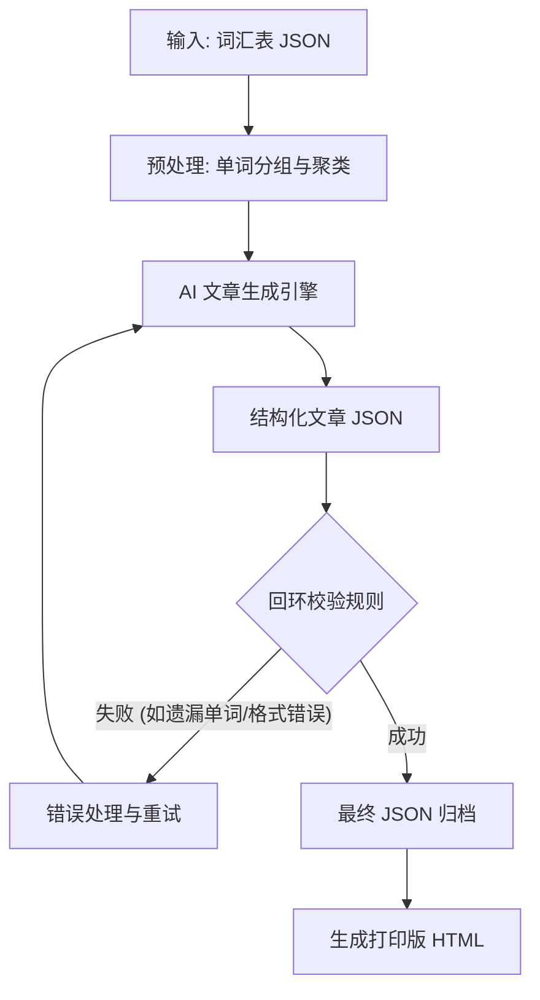

# SPEC_01: 结构化文章生成规范

> [!NOTE]
> 本文档定义了语言学习数据流水线的第一阶段（Phase 1）：**结构化文章生成 (Structured Article Generation)** 的完整技术规范。任何负责实现该阶段的 AI 代理或开发人员都必须严格遵循本文档中的数据结构、写作标准和校验流程。

## 1. 概述

本阶段的核心任务是接收一个包含目标词汇的 JSON 字典文件，并将其转化为结构化的、上下文连贯的文章数据（JSON 格式）。

生成的文章必须以 **SFI D 级别 (CEFR B1-B2)** 的瑞典语编写，并提供英语作为桥梁语言（Bridge Language）的完整翻译。每一篇文章都应该是一个连贯的故事或短文，将目标词汇自然地融入其中。



## 2. 输入规范 (Input Specification)

数据流水线的触发点是一个结构化的词汇表。

### 核心输入文件 (Primary Input)
一个包含瑞典语单词及其英语翻译的 JSON 文件（例如 `b1_ordlista.json`）。
* **格式**: `{ "swedish_word": "english_translation", ... }`
* **示例**: 
  ```json
  {
    "rivstart": "flying start",
    "soffpotatis": "couch potato",
    "hållbarhet": "sustainability",
    "återvinna": "recycle"
  }
  ```

### 配置参数 (Parameters)
生成过程需支持以下可配置参数：
* `words_per_article` (Integer): 每篇文章包含的**目标词**数量（默认值：20-30）。
* `article_length_words` (Integer): 目标文章的总词数长度（默认值：300-500）。
* `target_level` (String): 目标 CEFR 语言级别（默认值："B1-B2"）。
* `topic_hints` (Array<String>): 可选的主题建议列表（如 `["在医院", "找工作", "环保"]`）。如果为空，则由 AI 自由选择合适的主题。
* `native_language` (String): 学习者的母语/桥梁语言，用于生成翻译（默认值："english"）。
* `course_id` (String): 课程标识符，用于数据命名空间（默认值："rivstart_b1"）。
* `allow_word_overlap` (Boolean): 相同的单词是否可以作为目标词出现在多篇文章中（默认值：false）。
* `natural_reuse_target` (Integer): 每个单词在其“主出场”文章之外，还应该自然出现在多少篇文章中（默认值：2）。

## 3. 单词分组策略 (Word Grouping Strategy)

> [!IMPORTANT]
> 单词在分配到具体文章前，必须先进行语义相关性分组 (Semantic Grouping)。相关的单词在同一篇文章中出现，能创造更连贯的上下文，极大降低学习者的理解难度并提升记忆留存率。分组必须作为生成前的**预处理步骤**。

支持的分组方法按优先级递减如下：

1. **教材章节分组 (Textbook Chapter Grouping)**: 如果输入词汇来自特定教材（如 Rivstart），必须将原教材的章节分组作为首要信号。
2. **语义主题聚类 (Semantic Theme Clustering)**: 按语义主题将单词聚合（例如：食物、工作、家庭、自然、社会等）。
3. **AI 自动聚类 (AI Auto-clustering)**: 当缺乏明确的章节信息时，文章生成引擎需在生成前通过计算语义相似度对单词进行聚类分批。

## 4. 单词重合策略 (Word Overlap Strategy)

为实现 FSRS 间隔重复机制的最大效用，我们采用受控的单词复现策略：

* **主出场 (Primary Appearance)**: 每个单词在整个课程中拥有且仅有**一次**主出场机会。在该文章中，它被视为“核心目标词”进行高亮和重点考察。
* **自然复现 (Secondary Appearance)**: 相同的单词**可以且应该**在其他文章中自然出现（不作为高亮目标词）。
* **复现指标**: 目标是每个单词总共出现在 2-3 篇文章中（1次主出场 + 1至2次自然复现）。这种受控重复能在不显得冗余的前提下强化学习效果。
* **状态追踪**: 生成脚本必须在全局维护一个状态表，精确追踪哪些单词已被分配为“主出场”，哪些单词还需要“自然复现”，以确保输入词汇表的 100% 覆盖率。

## 5. SFI D 写作标准 (Writing Standards)

所有由 AI 生成的文章必须严格遵循以下 SFI D (CEFR B1-B2) 级别标准：

* **语言难度 (Language Level)**: 使用 B1-B2 级别的瑞典语词汇和语法。多用从句（如 att, eftersom, om），但要**避免** C1 及以上的生僻词汇和复杂修辞（如过于复杂的被动语态或古语）。
* **文章结构 (Article Structure)**: 必须具有清晰的叙事弧（引言、正文、结语）。不能是毫无逻辑的句子堆砌。
* **句子长度 (Sentence Length)**: 平均每句 10-15 个单词。长短句结合，保证阅读节奏。
* **目标词密度 (Target Word Density)**: 目标词汇应占文章总词数的 5-8%。
* **上下文线索 (Context Clues)**: 目标词必须置于“可通过上下文猜测词义”的语境中。例如，不要仅仅说 "Han är en soffpotatis" (他是个沙发土豆)，而应该说 "Han är en soffpotatis som sitter framför TV:n hela dagen och aldrig tränar" (他是个整天坐在电视前从不锻炼的沙发土豆)。
* **自然性 (Naturalness)**: 文本必须读起来像原生的瑞典语文章，坚决避免填鸭式的“生词表式”生硬造句。
* **主题多样性 (Topic Diversity)**: 覆盖日常生活的各个维度：职场、健康、社会现象、文化差异、环境、人际关系等。

## 6. 输出规范 (Output Specification)

AI 生成的结果必须被序列化为严格遵循以下结构的 JSON 数据。

> [!WARNING]
> `sv` 字段必须是纯文本，**不允许**包含任何 HTML 标签（如 `<strong>`）或 Markdown 标记（如 `**`）。高亮是通过 `position_start` 和 `position_end` 的字符索引实现的。

### JSON Schema & Example

```json
{
  "course_id": "rivstart_b1",
  "chapter_index": 1,
  "chapter_title": "Kapitel 1: Sport och hälsa",
  "topic": "sports_and_health",
  "target_word_count": 25,
  "sentences": [
    {
      "id": "ch01_s001",
      "sv": "Min granne är en riktig soffpotatis som aldrig tränar.",
      "en": "My neighbor is a real couch potato who never exercises.",
      "target_words": [
        {
          "word_in_sentence": "soffpotatis",
          "base_form": "soffpotatis",
          "position_start": 25,
          "position_end": 36
        },
        {
          "word_in_sentence": "tränar",
          "base_form": "träna",
          "position_start": 48,
          "position_end": 54
        }
      ]
    }
  ],
  "primary_words_used": ["soffpotatis", "träna", "granne"],
  "secondary_words_used": ["riktig", "aldrig"]
}
```

### 字段说明
* `id`: 句子全局唯一 ID，格式为 `ch{chapter_index:02d}_s{sentence_index:03d}`（例：ch01_s001）。
* `sv`: 完整的瑞典语原句文本。
* `en`: 该句子的完整英语翻译。
* `target_words`: 该句子中出现的目标词汇数组。
  * `word_in_sentence`: 单词在句子中的实际形态（可能发生了时态、单复数、变格等屈折变化）。
  * `base_form`: 单词的基础形态/字典形态（必须与输入词汇表 JSON 中的 key 完全匹配）。
  * `position_start` / `position_end`: 基于 `sv` 字符串的字符索引，采用左闭右开区间 `[start, end)`，用于精确高亮。
* `primary_words_used`: 列表，包含在本章中完成“主出场”的所有目标单词的 `base_form`。
* `secondary_words_used`: 列表，包含在本章中“自然复现”但在其他章节主出场的单词的 `base_form`。

## 7. 回环校验规则 (Validation Rules)

> [!CAUTION]
> 所有章节生成完毕后，必须运行自动化校验脚本。任何违反以下规则的输出都将导致流水线构建失败。

1. **100% 覆盖率**: 输入词汇表 JSON 中的**每一个**单词，都必须作为 `primary_words_used` 出现在且仅出现在一个章节中。
2. **无遗漏**: `base_form` 不能出现输入表外的生造词，输入表内的词也不能被遗漏。
3. **位置准确性**: 对于每个 target_word，提取 `sv.substring(position_start, position_end)` 必须完全等于 `word_in_sentence`。
4. **base_form 匹配**: 每一个 `base_form` 必须在原始输入字典中作为 key 存在。
5. **ID 唯一性**: 跨所有章节，`id` 字段必须保持全局唯一。
6. **翻译完整性**: `sentences` 数组中的每一个对象，其 `sv` 和 `en` 字段都不能为空字符串。

## 8. 打印输出规范 (Print Output)

除了 JSON 数据资产外，流水线还需为每章生成一个适合打印的静态 HTML 文件，以供离线阅读。

* **布局设计**: 采用左右双语对照布局（左侧为瑞典语原文，右侧为英语翻译）。
* **高亮样式**: 根据 JSON 中的字符索引，用 `<strong>` 标签将瑞典语文本中的目标词加粗。
* **词汇附录**: 在每章末尾自动生成“词汇表附录”，列出本章所有 `primary_words_used` 及其英文翻译。
* **打印优化**: 使用 CSS `@media print` 隐藏非必要 UI 元素，优化页边距。
* **版式排版**: 页面尺寸适配 A4；正文使用 Serif 字体（如 Georgia, Times New Roman），标题使用 Sans-serif 字体（如 Arial, Helvetica）。

## 9. Prompt 模板 (AI Prompt Template)

调用 LLM 时，应使用具备 Function Calling / Structured Output 功能的模型（如 GPT-4o 或 Gemini 1.5 Pro）。以下是核心 Prompt 模板：

```text
You are an expert Swedish language teacher specializing in SFI (Swedish for Immigrants) level D, which corresponds to CEFR B1-B2. 
Your task is to write a highly coherent, natural-sounding article/story in Swedish that seamlessly incorporates a specific list of target vocabulary words.

# WRITING STANDARDS:
1. Target Level: CEFR B1-B2. Use common grammatical structures appropriate for this level (e.g., subordinate clauses with 'att', 'eftersom', 'om'). Avoid overly academic C1/C2 phrasing.
2. Context Clues: When using a target word, provide enough context so a learner can guess its meaning. Do not just make a list of disconnected sentences.
3. Length & Flow: Write between 300-500 words. The article must have a clear beginning, middle, and end. 
4. Sentence Length: Average 10-15 words per sentence. Mix short and long sentences naturally.
5. Topic: Create an engaging story or essay about: {TOPIC_HINT}.

# TARGET VOCABULARY (MUST USE 100%):
{TARGET_WORDS_JSON}

# CONSTRAINTS & OUTPUT FORMAT:
You must output strictly in JSON format matching the requested schema.
- "sv": The Swedish sentence string MUST be plain text. DO NOT use markdown, HTML, or **bold** tags.
- "target_words": For each target word used in the sentence, identify its exact inflected form ("word_in_sentence"), its original base form ("base_form"), and its precise 0-indexed character positions ("position_start" and "position_end") in the "sv" string.
- You are strictly FORBIDDEN from skipping any word from the target vocabulary list. All words must have their primary appearance.
```

## 10. 错误处理与重试 (Error Handling)

为保证全自动化生产的稳定性，系统必须实现以下重试机制：

* **JSON 验证失败**: 如果 AI 返回的不是合法 JSON，或 Schema 不匹配，向 AI 返回确切的 Parser Error Message 并要求重试。
* **覆盖率校验失败**: 如果解析后发现遗漏了目标词汇表中的部分单词，系统需提取遗漏的词汇，通过 `Correction Prompt` 注入（例如："You missed the following words: ['ord1', 'ord2']. Please rewrite the article to include ALL provided target words."）。
* **重试上限**: 针对同一章节的生成，最大重试次数设定为 **3 次**。超过 3 次仍失败时，将该批次抛出异常并暂停，等待人工干预。
