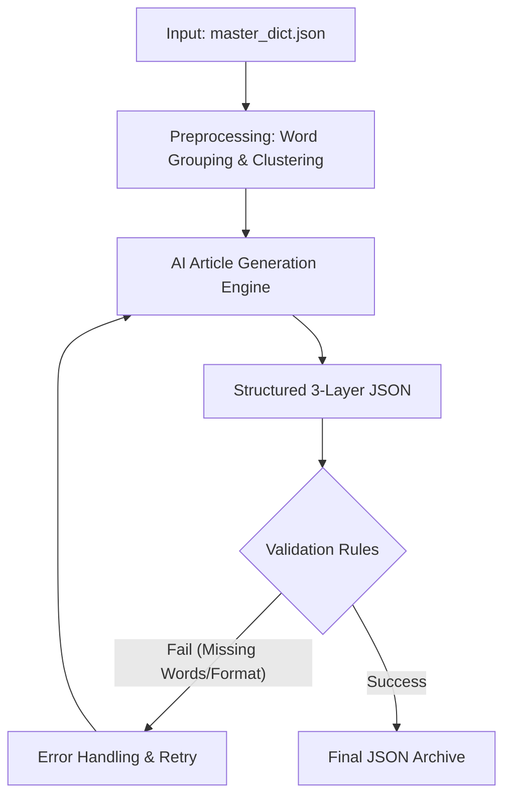

# Phase 2: Structured Article Generation

> [!NOTE]
> This document defines the technical specifications for Phase 2: **Structured Article Generation**. Any AI agent or developer implementing this phase must strictly adhere to the data structures, writing standards, and validation processes outlined below.

## 1. Overview

The core task of this phase is to receive the `master_dict.json` (generated in Phase 1) and transform its vocabulary into structured, contextually coherent article data (JSON format).

> [!IMPORTANT]
> **Autonomous Agent Workflow**: Phase 2 is NOT a dumb script looping through an API. It is designed to be executed by an autonomous AI Agent. The Agent must intelligently manage the workflow in three distinct steps:
> 1. **Semantic Clustering**: The Agent first analyzes the entire vocabulary list and intelligently groups words into coherent thematic clusters (future articles) based on semantics and context.
> 2. **Article Generation**: After clustering, the Agent generates articles for each cluster.
> 3. **AI Teacher Review (Loopback)**: A secondary AI (acting as an SFI language teacher) reviews, grades, and critiques the generated article to ensure B1 quality. If it fails, the article is rewritten.

Generated articles must be written in Swedish strictly at the **CEFR B1 (SFI Level D)** standard, providing English as the bridge language translation. Every article should be a coherent story or essay that naturally incorporates the target vocabulary.



## 2. Input Specification

### 2.1 Primary Input
*   **`master_dict.json`**: The clean, fully translated dictionary generated in Phase 1.

### 2.2 Parameters (Inherited)
*   **`source_level`**: Inherited from Phase 1. For this project, it is strictly **"B1"**. This parameter dictates the grammatical and vocabulary difficulty used by the AI generation engine.
*   **`native_language`**: Inherited from Phase 1 (Default: "English").

### 2.3 Configuration Parameters
*   `words_per_article` (Integer): Number of **target words** per article (Default: 50-60, allowing for denser vocabulary packing to reduce total article count).
*   `article_length_words` (Integer): Total word count of the target article (Default: 300-500).
*   `course_id` (String): Course identifier for the data namespace (Default: "sfid").
*   `allow_word_overlap` (Boolean): Whether the same word can appear as a target in multiple articles (Default: false).
*   `natural_reuse_target` (Integer): How many times a word should naturally appear in other articles beyond its "primary appearance" (Default: 2).

## 3. Autonomous Semantic Clustering (Sub-step 2.1)

> [!IMPORTANT]
> Before generating any articles, the AI Agent MUST perform a holistic review of the `master_dict.json` to intelligently cluster the words. Words related by context appearing in the same article create coherent narratives, significantly lowering learner comprehension barriers.

The AI Agent must autonomously execute the following:
1. **Analyze the Vocabulary**: Read the entire input dictionary.
2. **Determine Themes (Steps)**: Intelligently identify underlying semantic themes (e.g., healthcare, job hunting, daily routines, nature, society). These themes map to the "Step" layer in our architecture.
3. **Allocate Words (Articles)**: Group words into specific article clusters (e.g., 20-30 words per cluster) under each theme. The Agent must ensure words in a cluster share a strong semantic relationship that allows for natural story-telling.
4. **Finalize Blueprint**: Only when 100% of the words are assigned to a logical cluster does the Agent proceed to Article Generation (Sub-step 2.2).

## 4. Word Overlap Strategy

To maximize the effectiveness of the FSRS spaced repetition mechanism, we employ a controlled word recurrence strategy:

*   **Primary Appearance**: Every word has exactly **ONE** primary appearance across the entire course. In this specific article, it is treated as a "core target word" for highlighting.
*   **Secondary Appearance (Natural Reuse)**: The same word **can and should** appear naturally in other articles (but not as a highlighted target).
*   **Target Metric**: The goal is for each word to appear in 2-3 articles in total (1 primary + 1-2 secondary).
*   **State Tracking**: The generation script must maintain a global state table to precisely track which words have been allocated their "Primary Appearance" and which words still need "Secondary Appearances", ensuring 100% coverage of the input dictionary.

## 5. CEFR B1 (SFI D) Writing Standards

Because the input `source_level` is B1, all AI-generated articles must strictly adhere to the CEFR B1 (SFI Level D) standard:

*   **Language Difficulty**: Use B1 level Swedish vocabulary and grammar. Frequently use subordinate clauses (e.g., `att`, `eftersom`, `om`), but **avoid** C1+ obscure vocabulary or overly complex rhetorical structures (like advanced passive voices or archaic phrasing).
*   **Article Structure**: Must have a clear narrative arc (introduction, body, conclusion). Random sentences stacked together are not allowed.
*   **Sentence Length**: Average 10-15 words per sentence. Mix short and long sentences for reading rhythm.
*   **Target Word Density**: Target words can be packed densely (e.g., 10-15% of the total article word count, or approx. 60 words in a 500-word article), provided the text remains coherent, readable, and acceptable to a language teacher.
*   **Context Clues**: Target words must be placed in contexts where their meaning can be guessed. For example, instead of just "Han är en soffpotatis" (He is a couch potato), write "Han är en soffpotatis som sitter framför TV:n hela dagen och aldrig tränar" (He is a couch potato who sits in front of the TV all day and never exercises).
*   **Naturalness**: The text must read like native Swedish. Rigid, "vocab-list style" phrasing is strictly forbidden.

## 6. Output Specification (3-Layer Architecture)

The AI generation results must be serialized into JSON data strictly following a 3-layer hierarchical architecture: **Course -> Step -> Article**.

> [!WARNING]
> The `sv` field must be plain text. It is **NOT ALLOWED** to contain any HTML tags (like `<strong>`) or Markdown (like `**`). Highlighting is implemented via the exact character indices `position_start` and `position_end`.

### JSON Schema & Example

```json
{
  "course_id": "sfid",
  "course_title": "SFI D",
  "steps": [
    {
      "step_id": "step_01",
      "step_title": "Daily Life and Health",
      "articles": [
        {
          "article_id": "art_01",
          "article_title": "En dag på gymmet",
          "target_word_count": 25,
          "sentences": [
            {
              "sentence_id": "art01_s001",
              "sv": "Min granne är en riktig soffpotatis som aldrig tränar.",
              "en": "My neighbor is a real couch potato who never exercises.",
              "target_words": [
                {
                  "word_in_sentence": "soffpotatis",
                  "base_form": "soffpotatis",
                  "position_start": 25,
                  "position_end": 36
                },
                {
                  "word_in_sentence": "tränar",
                  "base_form": "träna",
                  "position_start": 48,
                  "position_end": 54
                }
              ]
            }
          ],
          "primary_words_used": ["soffpotatis", "träna", "granne"],
          "secondary_words_used": ["riktig", "aldrig"]
        }
      ]
    }
  ]
}
```

### Field Descriptions
*   `course_title`: A meaningful title for the course (e.g., "SFI D"). Do not expose internal IDs to the user.
*   `step_title`: A meaningful thematic title for the Step (e.g., "Daily Life and Health"). Do not include prefixes like "Step 1" as it exposes internal hierarchy.
*   `article_title`: A meaningful title for the specific reading article.
*   `sv`: The complete Swedish original sentence text.
*   `en`: The complete English translation of the ENTIRE sentence (NOT just the translation of the individual target words).
*   `target_words`: Array of target words appearing in the sentence.
    *   `word_in_sentence`: The actual inflected form of the word used in the sentence.
    *   `base_form`: The dictionary base form (MUST exactly match a key in `master_dict.json`).
    *   `position_start` / `position_end`: 0-indexed character bounds `[start, end)` relative to the `sv` string, used for precise UI highlighting.
*   `primary_words_used`: Words that completed their "Primary Appearance" in this article.
*   `secondary_words_used`: Words acting as natural reuse context in this article.

## 7. Validation Rules (Loopback)

> [!CAUTION]
> An automated validation script must run after generation. Any output violating these rules will fail the pipeline build.

1.  **100% Coverage**: Every word in `master_dict.json` MUST appear in `primary_words_used` in exactly one article.
2.  **No Hallucinations**: `base_form` cannot contain made-up words not found in the input dictionary.
3.  **Index Accuracy**: For every target_word, extracting `sv.substring(position_start, position_end)` MUST exactly equal `word_in_sentence`.
4.  **ID Uniqueness**: `sentence_id` and `article_id` must be globally unique across the dataset.
5.  **Translation Completeness**: The `sv` and `en` fields in the `sentences` array cannot be empty strings.

## 8. AI Teacher Review (Sub-step 2.3)

> [!IMPORTANT]
> To ensure the generated content meets strict educational standards, every generated article must be evaluated by a secondary AI Agent instructed to act as a professional SFI D language teacher.

For each generated article, the Teacher Agent must output a Markdown-formatted review containing:
1. **Helhetsintryck (Overall impression)**
2. **Grammatik och Ordförråd (Grammar and Vocabulary feedback)**: Correcting any unnatural phrasing or inappropriate verb particles.
3. **Struktur och Flyt (Structure and flow)**
4. **Betyg/Rekommendation (Grade and recommendation)**

**Refinement Loop**: If the Teacher Agent assigns a failing grade or identifies severe unnaturalness, the feedback must be routed back to the Generation Agent to rewrite the article. The final JSON is only saved when the Teacher Agent approves the text (e.g., Godkänt or Väl godkänt).

## 9. AI Prompt Template

When calling the LLM, use models with Function Calling / Structured Output capabilities (e.g., GPT-4o or Gemini 1.5 Pro). Update the prompt template to strictly enforce the B1 level and the 3-layer architecture:

```text
You are an expert Swedish language teacher specializing in CEFR Level B1 (SFI Level D). 
Your task is to write a highly coherent, natural-sounding article in Swedish that seamlessly incorporates a specific list of target vocabulary words.

# WRITING STANDARDS:
1. Target Level: STRICTLY CEFR B1. Use grammatical structures appropriate for this level (e.g., subordinate clauses with 'att', 'eftersom', 'om'). Avoid overly academic C1/C2 phrasing.
2. Context Clues: When using a target word, provide enough context so a learner can guess its meaning. Do not just make a list of disconnected sentences.
3. Length & Flow: Write between 300-500 words. The article must have a clear beginning, middle, and end. 
4. Sentence Length: Average 10-15 words per sentence. Mix short and long sentences naturally.
5. Topic: Create an engaging story or essay about: {THEMATIC_STEP_TITLE}. Give the article a meaningful title.

# TARGET VOCABULARY (MUST USE 100%):
{TARGET_WORDS_JSON}

# CONSTRAINTS & OUTPUT FORMAT:
You must output strictly in JSON format matching the requested 3-layer schema (Course -> Step -> Article).
- "sv": The Swedish sentence string MUST be plain text. DO NOT use markdown, HTML, or **bold** tags.
- "en": You MUST provide the English translation for the ENTIRE Swedish sentence. Do not just translate the isolated target words.
- "target_words": For each target word used in the sentence, identify its exact inflected form ("word_in_sentence"), its original base form ("base_form"), and its precise 0-indexed character positions ("position_start" and "position_end") in the "sv" string.
- You are strictly FORBIDDEN from skipping any word from the target vocabulary list. All words must have their primary appearance.
```

## 9. Error Handling

*   **JSON Validation Failure**: If the AI returns invalid JSON or fails schema validation, return the exact Parser Error Message to the AI and demand a retry.
*   **Coverage Validation Failure**: If words are missing, extract the missing words and inject them via a `Correction Prompt` (e.g., "You missed the following words: ['word1']. Please rewrite the article to include ALL provided target words.").
*   **Retry Limit**: Maximum **3 retries** per article generation. After 3 failures, throw an exception and pause for manual intervention.
