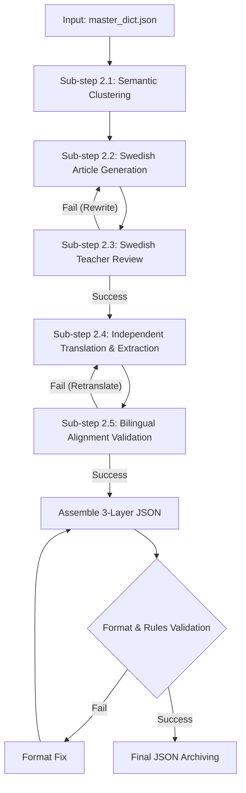

# Phase 2: Structured Article Generation

> [!NOTE]
> This document defines the technical specifications for Phase 2: **Structured Article Generation**. Any AI agent or developer responsible for implementing this phase must strictly adhere to the data structures, writing standards, and validation processes outlined below.

## 1. Overview

The core objective of this phase is to receive the `master_dict.json` (generated in Phase 1) and transform its vocabulary into structured, contextually coherent article data (in JSON format).

> [!IMPORTANT]
> **Autonomous Agent Workflow**: Phase 2 is absolutely NOT a script that mindlessly calls APIs in a loop in the background. It is designed to be executed by an autonomous AI Agent. The agent must intelligently manage the entire workflow through several distinct steps:
> 1. **Semantic Clustering**: The agent first analyzes the entire input vocabulary and uses its intelligence to classify words into coherent thematic clusters (which will become articles) based on semantics and context.
> 2. **Article Generation**: Once clustering is complete, the agent begins generating articles for each cluster.
> 3. **AI Teacher Review**: A secondary AI (acting as an SFI language teacher) reviews, grades, and corrects the generated articles to ensure B1 quality. If it fails, it must be rewritten.
> 4. **Independent Translation**: Once the Swedish article is approved, it is translated sentence-by-sentence.
> 5. **Translation Validation**: A bilingual AI teacher reviews the translation for structural alignment and grammar correctness.

The generated articles must be written strictly following **CEFR B1 (SFI Level D)** standards in Swedish, with English provided as a bridge language translation. Each article should be a coherent story or short essay, naturally incorporating the target vocabulary.



## 2. Input Specification

### 2.1 Primary Input
*   **`master_dict.json`**: The clean, fully translated dictionary generated in Phase 1.

### 2.2 Parameters (Inherited)
*   **`source_level`**: Inherited from Phase 1. For this project, strictly limited to **"B1"**. This dictates the grammar and vocabulary difficulty used by the AI generation engine.
*   **`native_language`**: Inherited from Phase 1 (Default: "English").

### 2.3 Configuration Parameters
*   `words_per_article` (Integer): Number of **target words** to include per article (Default: 50-60, allowing high-density packing to reduce total article count).
*   `article_length_words` (Integer): Target total word count of the article (Default: 300-500).
*   `course_id` (String): Course identifier for data namespace (Default: "sfid").
*   `allow_word_overlap` (Boolean): Whether the same word can appear as a target word in multiple articles (Default: false).
*   `natural_reuse_target` (Integer): How many additional articles a word should naturally appear in outside of its "primary appearance" (Default: 2).

## 3. Autonomous Semantic Clustering (Sub-step 2.1)

> [!IMPORTANT]
> Before generating any articles, the AI agent must globally review `master_dict.json` to intelligently cluster and classify the words. Grouping contextually related words in the same article creates a coherent narrative, significantly lowering the learning barrier for users.

The AI Agent must autonomously perform the following:
1. **Analyze Vocabulary**: Read the entire input dictionary.
2. **Identify Themes (Stages)**: Intelligently identify potential semantic themes (e.g., Healthcare, Job Hunting, Daily Life, Nature, Society). These themes map to the "Stage" layer in our data architecture.
3. **Allocate Words (Articles)**: Allocate words into specific article clusters under each theme (e.g., 50-60 words per cluster). The agent must ensure strong semantic relevance within a cluster to allow for natural storytelling.
4. **Finalize Blueprint**: The agent may only proceed to Article Generation (Sub-step 2.2) once 100% of the words have been logically allocated into clusters.

## 4. Word Overlap Strategy

To maximize the effectiveness of the FSRS spaced repetition mechanism, we employ a controlled word recurrence strategy:

*   **Primary Appearance**: Every word has exactly **one** primary appearance across the entire course. In that article, it is treated as a highlighted "core target word".
*   **Secondary Appearance (Natural Reuse)**: The same word is **allowed** to appear naturally in other articles (but not as a highlighted target word). Given the extremely high density of target words (50-60 per article), natural reuse is **NOT mandatory**, to avoid forcing the AI to write unnatural sentences.
*   **State Tracking**: The generation script must maintain a global state table to precisely track which words have been allocated for their "Primary Appearance", ensuring 100% coverage of the input dictionary.

## 5. CEFR B1 (SFI D) Writing Standards

Since the input `source_level` is B1, all AI-generated articles must strictly adhere to CEFR B1 (SFI Level D) standards:

*   **Language Difficulty**: Use B1-level Swedish vocabulary and grammar. Frequently use subordinate clauses (e.g., `att`, `eftersom`, `om`), but **avoid** C1+ obscure vocabulary or overly complex phrasing (like advanced passive voice or archaic language).
*   **Article Structure**: Must have a clear narrative arc (introduction, body, conclusion). It cannot be a random pile of disconnected sentences.
*   **Sentence Length**: Average 10-15 words per sentence. Mix short and long sentences to ensure a good reading rhythm.
*   **Target Word Density**: Target words can be dense (e.g., ~50-60 target words in a 500-word article), provided the text remains coherent and readable.
*   **Context Clues**: Target words must be placed in a context where their meaning can be guessed. For example, instead of just "Han är en soffpotatis" (He is a couch potato), write "Han är en soffpotatis som sitter framför TV:n hela dagen och aldrig tränar" (He is a couch potato who sits in front of the TV all day and never exercises).
*   **Bilingual Alignment**: Data must provide precise sentence-to-sentence translation. The `en` field in JSON **must** be the full English translation of the entire Swedish sentence.
*   **Naturalness**: The text must read like a native Swedish article. Forced, unnatural "vocabulary list" style sentences are strictly forbidden.

## 6. Output Specification (3-Layer Architecture)

The AI-generated results must be serialized into JSON data strictly adhering to a 3-layer nested architecture: **Course -> Stage -> Article**.

> [!WARNING]
> The `sv` field must be plain text. **HTML tags (like `<strong>`) or Markdown (like `**`) are NOT allowed.** Highlighting is achieved through precise character indices `position_start` and `position_end`.

### JSON Schema & Example

```json
{
  "course_id": "sfid",
  "course_title": "SFI D",
  "stages": [
    {
      "stage_id": "stage_01",
      "stage_title": "Daily Life and Health",
      "articles": [
        {
          "article_id": "art_01",
          "article_title": "En dag på gymmet",
          "target_word_count": 25,
          "sentences": [
            {
              "sentence_id": "art01_s001",
              "sv": "Min granne är en riktig soffpotatis som aldrig tränar.",
              "en": "My neighbor is a real couch potato who never exercises.",
              "target_words": [
                {
                  "word_in_sentence": "soffpotatis",
                  "base_form": "soffpotatis",
                  "contextual_en": "couch potato",
                  "position_start": 25,
                  "position_end": 36
                },
                {
                  "word_in_sentence": "tränar",
                  "base_form": "träna",
                  "contextual_en": "exercises",
                  "position_start": 48,
                  "position_end": 54
                }
              ],
              "secondary_words": [
                {
                  "word_in_sentence": "granne",
                  "base_form": "granne",
                  "contextual_en": "neighbor",
                  "position_start": 4,
                  "position_end": 10
                }
              ]
            }
          ],
          "primary_words_used": ["soffpotatis", "träna", "granne"],
          "secondary_words_used": ["riktig", "aldrig"]
        }
      ]
    }
  ]
}
```

### Field Descriptions
*   `course_title`: Meaningful title of the course (e.g., "SFI D"). Do not expose internal IDs to the user.
*   `stage_title`: Meaningful thematic title for the Stage (e.g., "Daily Life"). Do not include prefixes like "Stage 1" to hide internal hierarchy.
*   `article_title`: Descriptive title for the specific reading article.
*   `sv`: The complete original Swedish sentence string.
*   `en`: The **entire** sentence's full English translation (Never just translate the isolated target words).
*   `target_words`: Array of target words appearing in the sentence.
    *   `word_in_sentence`: The actual inflected form of the word used in the sentence.
    *   `base_form`: The dictionary base form (MUST exactly match a key in `master_dict.json`).
    *   `contextual_en`: The specific English translation of this word strictly as it is used in the context of this sentence.
    *   `position_start` / `position_end`: 0-indexed character boundaries `[start, end)` based on the `sv` string for precise UI highlighting.
*   `secondary_words`: Array of additional, non-target words that are useful for a B1 learner (e.g., moderately difficult verbs, nouns). Follows the exact same object structure (`word_in_sentence`, `base_form`, `contextual_en`, `position_start`, `position_end`) as `target_words`.
*   `primary_words_used`: Words that completed their "Primary Appearance" in this article.
*   `secondary_words_used`: Words acting as natural reuse context in this article.

## 7. Validation Rules (Loopback)

> [!CAUTION]
> An automated validation script must be run after generation. Any output violating the following rules will cause the pipeline build to fail.

1.  **100% Coverage**: Every word in `master_dict.json` MUST appear in `primary_words_used` in exactly one article.
2.  **No Hallucinations**: `base_form` cannot contain fabricated words that do not exist in the input dictionary.
3.  **Index Accuracy**: For every `target_word` and `secondary_word`, extracting `sv.substring(position_start, position_end)` MUST equal `word_in_sentence` exactly.
4.  **ID Uniqueness**: `sentence_id` and `article_id` must be globally unique across the dataset.
5.  **Translation Completeness**: The `sv` and `en` fields in the `sentences` array cannot be empty strings.

## 8. AI Teacher Review (Sub-step 2.3)

> [!IMPORTANT]
> To ensure the generated content meets strict educational standards, every generated article must be reviewed by a secondary AI agent playing the role of a "Professional SFI Level D Language Teacher".

For each generated article, the Teacher Agent must output a Markdown-formatted review report containing:
1. **Overall Impression (Helhetsintryck)**
2. **Grammar and Vocabulary (Grammatik och Ordförråd)**: Correct any unnatural phrasing or improperly used phrasal verbs.
3. **Structure and Flow (Struktur och Flyt)**
4. **Grade/Recommendation (Betyg/Rekommendation)**

**Refinement Loop**: If the Teacher Agent gives a failing grade or points out severe unnaturalness, this feedback must be returned to the Generation Agent, forcing it to rewrite the article. The translation step may only begin once the Teacher Agent approves the article (e.g., by giving a Godkänt or Väl godkänt grade).

## 9. Independent Bilingual Translation & Validation (Sub-step 2.4 & 2.5)

> [!IMPORTANT]
> The translation task must absolutely not be mixed with the article generation task for the AI to complete in one shot. Writing the article must be split from the full bilingual translation into independent steps in the pipeline.

**Sub-step 2.4: Independent Sentence-by-Sentence Translation**
Once the pure Swedish article passes the Teacher Review in 2.3, it is handed over to a dedicated Translation AI to translate sentence by sentence, while extracting the coordinates of the words.
Core principles for translation: **Structural Alignment and Grammatical Correctness**.
*   The English translation must mirror the sentence structure of the original Swedish sentence as closely as possible (high structural alignment) so learners can map words directly.
*   While aligning the structure, the output English must still follow absolutely correct English grammar.
*   During this stage, the AI is also required to generate precise contextual translations (`contextual_en`) for both `target_words` and `secondary_words` based on the current sentence.

**Sub-step 2.5: Translation Validation Loop**
Once translated, it is reviewed by a validation model acting as a "Bilingual SFI Teacher".
*   **Review Scope**: Compare the Swedish original and English translation to check for missing clauses, structural alignment, and grammatical correctness. Also verify the accuracy of `contextual_en`.
*   **Refinement Loop**: If the teacher finds the translation structure deviates too much from the original, or there are grammatical errors, it must provide specific correction advice and send it back to the translation model for a mandatory retranslation. The final JSON can only be assembled after full teacher approval.

## 10. AI Prompt Template Reference

Because the tasks are split, different prompts should be sent to the LLM depending on the specific step. Update your Prompt templates to strictly enforce B1 level and the 3-layer architecture.

### 10.1 Swedish Article Generation Prompt (Sub-step 2.2)

```text
You are an expert Swedish language teacher specializing in CEFR Level B1 (SFI Level D). 
Your task is to write a highly coherent, natural-sounding article in Swedish that seamlessly incorporates a specific list of target vocabulary words.

# WRITING STANDARDS:
1. Target Level: STRICTLY CEFR B1. Use grammatical structures appropriate for this level (e.g., subordinate clauses with 'att', 'eftersom', 'om'). Avoid overly academic C1/C2 phrasing.
2. Context Clues: When using a target word, provide enough context so a learner can guess its meaning. Do not just make a list of disconnected sentences.
3. Length & Flow: Write between 300-500 words. The article must have a clear beginning, middle, and end. 
4. Sentence Length: Average 10-15 words per sentence. Mix short and long sentences naturally.
5. Topic: Create an engaging story or essay about: {THEMATIC_STAGE_TITLE}. Give the article a meaningful title.

# TARGET VOCABULARY (MUST USE 100%):
{TARGET_WORDS_JSON}

# CONSTRAINTS & OUTPUT FORMAT:
You must output strictly in JSON format matching the requested 3-layer schema (Course -> Stage -> Article).
- "sv": The Swedish sentence string MUST be plain text. DO NOT use markdown, HTML, or **bold** tags.
- "en": Leave this empty for now, it will be handled by the translation step.
- "target_words": Extract the words, but leave `contextual_en` empty for now.
- You are strictly FORBIDDEN from skipping any word from the target vocabulary list. All target words must have their primary appearance.
```

### 10.2 Independent Translation & Extraction Prompt (Sub-step 2.4)

```text
You are an expert bilingual translator (Swedish to English) assisting a CEFR Level B1 (SFI Level D) language teacher.
You will receive a Swedish text. Your task is to process it sentence by sentence, providing translations and extracting specific words.

# TRANSLATION STANDARDS:
1. Structural Alignment: You MUST translate each sentence in a way that closely mirrors the original Swedish sentence structure to help learners map words directly. 
2. Grammatical Correctness: While mirroring the Swedish structure, the resulting English MUST still follow strictly correct English grammar.
3. Sentence-by-Sentence: You must process and output the exact Swedish sentence ("sv") alongside its full English translation ("en").

# WORD EXTRACTION & CONTEXTUAL TRANSLATION:
- "target_words": For each requested target word present in the sentence, extract its inflected form ("word_in_sentence"), base form ("base_form"), character bounds ("position_start", "position_end"), and MOST IMPORTANTLY: its precise contextual English translation ("contextual_en") as used strictly in this sentence.
- "secondary_words": Voluntarily select 20-30 non-target, moderately difficult words across the whole text. Extract them using the exact same strict schema (including `contextual_en`). Never extract trivial A1 words (och, att, är).

You must output strictly in the designated JSON schema.
```

## 11. Error Handling

*   **JSON Validation Failure**: If the AI returns invalid JSON or fails Schema validation, return the precise parser error message back to the AI and demand a retry.
*   **Coverage Failure**: If words were missed, extract the missed words and inject them via a correction prompt (e.g., "You missed the following words: ['word1']. Please rewrite the article to include ALL provided target words.").
*   **Retry Limit**: Maximum retries for generating an article is **3 times**. After 3 consecutive failures, throw an exception and pause for manual intervention.
