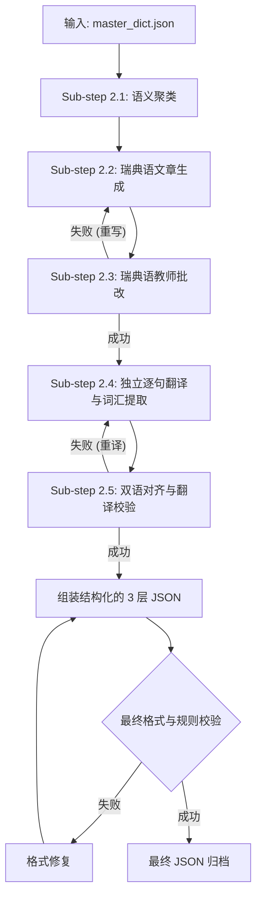

# Phase 2: 结构化文章生成

> [!NOTE]
> 本文档定义了第二阶段（Phase 2）：**结构化文章生成 (Structured Article Generation)** 的技术规范。任何负责实现该阶段的 AI 代理或开发人员都必须严格遵循本文档中的数据结构、写作标准和校验流程。

## 1. 概述

本阶段的核心任务是接收 `master_dict.json`（在 Phase 1 中生成），并将其词汇转化为结构化的、上下文连贯的文章数据（JSON 格式）。

生成的文章必须严格按照 **CEFR B1 (SFI D 级别)** 的瑞典语标准编写，并提供英语作为桥梁语言的完整翻译。每一篇文章都应该是一个连贯的故事或短文，将目标词汇自然地融入其中。



## 2. 输入规范

### 2.1 核心输入
*   **`master_dict.json`**: 在 Phase 1 中生成的干净、翻译完整的词典。

### 2.2 继承参数
*   **`source_level`**: 继承自 Phase 1。对于本项目，严格限定为 **"B1"**。该参数决定了 AI 生成引擎使用的语法和词汇难度。
*   **`native_language`**: 继承自 Phase 1（默认："English"）。

### 2.3 配置参数
*   `words_per_article` (Integer): 每篇文章包含的**目标词**数量（默认值：50-60，允许较高密度的词汇打包以减少文章总数）。
*   `article_length_words` (Integer): 目标文章的总词数长度（默认值：300-500）。
*   `course_id` (String): 课程标识符，用于数据命名空间（默认值："sfid"）。
*   `allow_word_overlap` (Boolean): 相同的单词是否可以作为目标词出现在多篇文章中（默认值：false）。
*   `natural_reuse_target` (Integer): 每个单词在其“主出场”文章之外，还应该自然出现在多少篇文章中（默认值：2）。

## 3. 单词分组策略

> [!IMPORTANT]
> 单词在分配到具体文章前，必须先进行语义相关性分组。相关的单词在同一篇文章中出现，能创造更连贯的上下文，极大降低学习者的理解难度。

支持的分组方法按优先级递减如下：
1.  **语义主题聚类 (Semantic Theme Clustering)**: 按语义主题将单词聚合（例如：食物、工作、家庭、自然、社会）。这直接映射到我们数据架构中的 "Stage" 层。
2.  **教材章节分组**: 如果有特定的章节元数据，按章节分组。
3.  **AI 自动聚类**: 当缺乏明确的主题时，AI 引擎必须根据语义相似度动态聚类单词。

## 4. 单词重合策略

为实现 FSRS 间隔重复机制的最大效用，我们采用受控的单词复现策略：

*   **主出场 (Primary Appearance)**: 每个单词在整个课程中拥有且仅有**一次**主出场机会。在该文章中，它被视为高亮的“核心目标词”。
*   **自然复现 (Secondary Appearance)**: 相同的单词**允许**在其他文章中自然出现（但不作为高亮目标词）。考虑到目前目标词汇密度极高，**不要强制要求**自然复现，以免约束冲突导致 AI 编造生硬的句子。
*   **状态追踪**: 生成脚本必须在全局维护一个状态表，精确追踪哪些单词已被分配为“主出场”，以确保输入词典的 100% 覆盖率。

## 5. CEFR B1 (SFI D) 写作标准

由于输入的 `source_level` 为 B1，所有 AI 生成的文章必须严格遵循 CEFR B1 (SFI Level D) 标准：

*   **语言难度**: 使用 B1 级别的瑞典语词汇和语法。频繁使用从句（如 `att`, `eftersom`, `om`），但要**避免** C1 及以上的生僻词汇或过于复杂的修辞（如高级被动语态或古语）。
*   **文章结构**: 必须具有清晰的叙事弧（引言、正文、结语）。不能是毫无逻辑的句子堆砌。
*   **句子长度**: 平均每句 10-15 个单词。长短句结合，保证阅读节奏。
*   **目标词密度**: 目标词汇可以比较密集（例如，在 500 字的文章中包含约 50-60 个目标词），前提是文本依然连贯、可读。
*   **上下文线索**: 目标词必须置于“可通过上下文猜测词义”的语境中。例如，不要仅仅说 "Han är en soffpotatis" (他是个沙发土豆)，而应该说 "Han är en soffpotatis som sitter framför TV:n hela dagen och aldrig tränar" (他是个整天坐在电视前从不锻炼的沙发土豆)。
*   **双语对齐与翻译 (Bilingual Alignment)**: 数据必须提供句到句的精准翻译。JSON 中的 `en` 字段**必须**是整句瑞典语的完整英文翻译，绝不能仅仅是单词的翻译。
*   **自然性**: 文本必须读起来像原生的瑞典语文章，坚决避免填鸭式的“生词表式”生硬造句。

## 6. 输出规范 (三层架构)

AI 生成的结果必须被序列化为严格遵循三层嵌套架构的 JSON 数据：**Course -> Stage -> Article**。

> [!WARNING]
> `sv` 字段必须是纯文本。**不允许**包含任何 HTML 标签（如 `<strong>`）或 Markdown（如 `**`）。高亮是通过精确的字符索引 `position_start` 和 `position_end` 实现的。

### JSON Schema & Example

```json
{
  "course_id": "sfid",
  "course_title": "SFI D",
  "stages": [
    {
      "stage_id": "stage_01",
      "stage_title": "Daily Life and Health",
      "articles": [
        {
          "article_id": "art01",
          "article_title": "En dag på gymmet",
          "target_word_count": 25,
          "sentences": [
            {
              "sentence_id": "art01_s001",
              "sv": "Min granne är en riktig soffpotatis som aldrig tränar.",
              "en": "My neighbor is a real couch potato who never exercises.",
              "target_words": [
                {
                  "word_in_sentence": "soffpotatis",
                  "base_form": "soffpotatis",
                  "contextual_en": "couch potato",
                  "position_start": 25,
                  "position_end": 36
                },
                {
                  "word_in_sentence": "tränar",
                  "base_form": "träna",
                  "contextual_en": "exercises",
                  "position_start": 48,
                  "position_end": 54
                }
              ],
              "secondary_words": [
                {
                  "word_in_sentence": "granne",
                  "base_form": "granne",
                  "contextual_en": "neighbor",
                  "position_start": 4,
                  "position_end": 10
                }
              ]
            }
          ],
          "primary_words_used": ["soffpotatis", "träna", "granne"],
          "secondary_words_used": ["riktig", "aldrig"]
        }
      ]
    }
  ]
}
```

### 字段说明
*   `course_title`: 课程的有意义的标题（例如 "SFI D"）。不要向用户暴露内部 ID。
*   `stage_title`: Stage 的有意义的主题标题（例如 "日常生活"）。不要包含 "Stage 1" 等前缀，以免暴露内部层级。
*   `article_title`: 具体阅读文章的有意义的标题。
*   `sv`: 完整的瑞典语原句文本。
*   `en`: **整句**完整的英文翻译（千万不要仅仅翻译那些目标单词，而是要翻译整个句子）。
*   `target_words`: 句子中出现的目标词汇数组。
    *   `word_in_sentence`: 单词在句子中的实际形态（可能发生了变位）。
    *   `base_form`: 字典基本形态（必须与 `master_dict.json` 中的 key 完全匹配）。
    *   `contextual_en`: 该单词在当前句子特定语境下的英文翻译。
    *   `position_start` / `position_end`: 基于 `sv` 字符串的 0 索引字符边界 `[start, end)`，用于 UI 精确高亮。
*   `secondary_words`: 额外的非大纲拓展词汇数组（针对 B1 学习者有难度的动词、名词等）。它的对象结构与 `target_words` 完全一致（包含 `word_in_sentence`, `base_form`, `contextual_en`, `position_start`, `position_end`）。
*   `primary_words_used`: 在本篇文章中完成“主出场”的词汇。
*   `secondary_words_used`: 在本篇文章中作为自然复现上下文的词汇。

## 7. 校验规则 (回环)

> [!CAUTION]
> 生成后必须运行自动校验脚本。任何违反以下规则的输出都将导致流水线构建失败。

1.  **100% 覆盖率**: `master_dict.json` 中的每个词必须作为 `primary_words_used` 出现在且仅出现在一篇文章中。
2.  **无生造词 (No Hallucinations)**: `base_form` 不能包含输入词典中没有的编造词。
3.  **索引准确性**: 对于每个 target_word，提取 `sv.substring(position_start, position_end)` 必须完全等于 `word_in_sentence`。
4.  **ID 唯一性**: `sentence_id` 和 `article_id` 必须在全局唯一。
5.  **翻译完整性**: `sentences` 数组中的 `sv` 和 `en` 字段不能为空字符串。

## 8. AI 教师批改环节 (Sub-step 2.3)

> [!IMPORTANT]
> 为了确保生成的内容符合严格的教育标准，生成的每一篇文章都必须交由一个扮演“专业 SFI D 级语言教师”的次级 AI 智能体进行评审。

对于每一篇生成的文章，教师智能体必须输出一份 Markdown 格式的批改报告，包含以下四项内容：
1. **整体印象 (Helhetsintryck)**
2. **语法和词汇 (Grammatik och Ordförråd)**：纠正任何不自然的表达或使用不当的动词短语。
3. **结构和连贯度 (Struktur och Flyt)**
4. **评分/建议 (Betyg/Rekommendation)**

**精炼循环 (Refinement Loop)**：如果教师智能体给出了不及格的评分，或者指出了严重的行文不自然，这些反馈必须返回给生成智能体，强制其重写该文章。只有当教师智能体批准该文章（例如给出 Godkänt 或 Väl godkänt 评分）后，才允许进入翻译环节。

## 9. 独立双语翻译与校验环节 (Sub-step 2.4 - 2.6)

> [!IMPORTANT]
> 翻译任务绝对不能与文章生成任务混在一起让 AI 一次性完成。文章的撰写必须与全文双语翻译拆分为流水线上的独立步骤。

**Sub-step 2.4: 独立逐句翻译**
当纯瑞典语文章通过了 2.3 环节的教师批改后，交由专门的翻译 AI 进行逐句翻译，并同时提取目标词汇的坐标。
翻译时的核心原则：**结构对齐与语法正确**。
*   必须保证瑞典语原句与英语翻译在“句式结构”上尽可能保持相同（高度镜像对齐），以便学习者逐字对照。
*   在保证句式对齐的同时，必须确保输出的英文符合绝对正确的英文语法。
*   在此阶段，同时要求 AI 为句子中的 `target_words` 和 `secondary_words` 生成基于当前句子精确语境的 `contextual_en`。

**Sub-step 2.5: 翻译校验环节**
翻译完成后，交由一位扮演“双语 SFI 教师”的验证模型进行审查。
*   **审查内容**：对比瑞典语原句和英文翻译，检查是否遗漏了子句、是否保持了相同的句式结构，以及英文语法是否正确。同时审查 `contextual_en` 是否精准。
*   **精炼循环**：如果教师发现翻译与原句句式差异过大，或者存在英语语法错误，必须给出具体的修改建议，并打回给翻译模型强制重译。只有在教师完全批准后，才能组装最终的 JSON。

**Sub-step 2.6: 统计与反向验证 (Statistical Verification)**
为了解决大模型在提取单词（尤其是 `secondary_words`）时偶尔出现的遗漏、偷懒或幻觉问题，必须在生成/提取阶段的最后强制加入一个统计校验步骤。
*   **操作**：强制要求 LLM 输出一个统计表格，汇总当前批次文章的数据。表格列必须包含：`文章 ID`、`句子总数`、`提取的 target_words 总数`、`提取的 secondary_words 总数`、`英文翻译(en)总数`。
*   **评估规则**：控制端脚本/主控 Agent 必须读取并解析这个表格。如果发现某篇文章的 `secondary_words` 数量不达标（例如低于 20 个），或者某句话缺少英文翻译，必须精准定位到具体失败的文章或句子。
*   **修复循环**：如果发现问题，将带有明确指控的 Prompt 发回给大模型进行定向修复（例如：“文章 X 仅提取了 5 个 secondary_words，你需要提取 20-30 个。请重新处理文章 X 并补充提取词汇。”）。只有当统计数据完全达标后，才允许保存最终的 JSON 文件。

## 10. AI Prompt 模板参考

由于任务被拆分，调用 LLM 时应根据具体步骤发送专属 Prompt。更新 Prompt 模板以严格强制执行 B1 级别和三层架构。

### 10.1 瑞典语文章生成 Prompt (Sub-step 2.2)

```text
You are an expert Swedish language teacher specializing in CEFR Level B1 (SFI Level D). 
Your task is to write a highly coherent, natural-sounding article in Swedish that seamlessly incorporates a specific list of target vocabulary words.

# WRITING STANDARDS:
1. Target Level: STRICTLY CEFR B1. Use grammatical structures appropriate for this level (e.g., subordinate clauses with 'att', 'eftersom', 'om'). Avoid overly academic C1/C2 phrasing.
2. Context Clues: When using a target word, provide enough context so a learner can guess its meaning. Do not just make a list of disconnected sentences.
3. Length & Flow: Write between 300-500 words. The article must have a clear beginning, middle, and end. 
4. Sentence Length: Average 10-15 words per sentence. Mix short and long sentences naturally.
5. Topic: Create an engaging story or essay about: {THEMATIC_STAGE_TITLE}. Give the article a meaningful title.

# TARGET VOCABULARY (MUST USE 100%):
{TARGET_WORDS_JSON}

# CONSTRAINTS & OUTPUT FORMAT:
You must output strictly in JSON format matching the requested 3-layer schema (Course -> Stage -> Article).
- "sv": The Swedish sentence string MUST be plain text. DO NOT use markdown, HTML, or **bold** tags.
- "en": Leave this empty for now, it will be handled by the translation step.
- "target_words": Extract the words, but leave `contextual_en` empty for now.
- You are strictly FORBIDDEN from skipping any word from the target vocabulary list. All target words must have their primary appearance.
```

### 10.2 独立逐句翻译与词汇提取 Prompt (Sub-step 2.4)

```text
You are an expert bilingual translator (Swedish to English) assisting a CEFR Level B1 (SFI Level D) language teacher.
You will receive a Swedish text. Your task is to process it sentence by sentence, providing translations and extracting specific words.

# TRANSLATION STANDARDS:
1. Structural Alignment: You MUST translate each sentence in a way that closely mirrors the original Swedish sentence structure to help learners map words directly. 
2. Grammatical Correctness: While mirroring the Swedish structure, the resulting English MUST still follow strictly correct English grammar.
3. Sentence-by-Sentence: You must process and output the exact Swedish sentence ("sv") alongside its full English translation ("en").

# WORD EXTRACTION & CONTEXTUAL TRANSLATION:
- "target_words": For each requested target word present in the sentence, extract its inflected form ("word_in_sentence"), base form ("base_form"), character bounds ("position_start", "position_end"), and MOST IMPORTANTLY: its precise contextual English translation ("contextual_en") as used strictly in this sentence.
- "secondary_words": Voluntarily select 20-30 non-target, moderately difficult words across the whole text. Extract them using the exact same strict schema (including `contextual_en`). Never extract trivial A1 words (och, att, är).

You must output strictly in the designated JSON schema.
```

## 11. 错误处理

*   **JSON 验证失败**: 如果 AI 返回无效的 JSON 或未通过 Schema 验证，将精确的解析器错误消息返回给 AI 并要求重试。
*   **覆盖率校验失败**: 如果遗漏了单词，提取遗漏的词汇并通过“纠正 Prompt”注入（例如："You missed the following words: ['word1']. Please rewrite the article to include ALL provided target words."）。
*   **重试上限**: 每篇文章生成的最大重试次数为 **3 次**。连续 3 次失败后，抛出异常并暂停等待人工干预。
