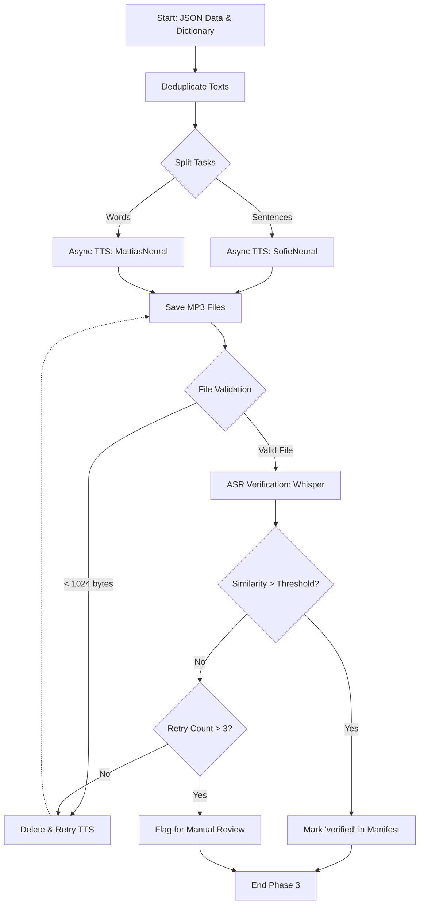

# 规格说明文档 - 阶段 3: 音频生成与校验 (Phase 3: Audio TTS Generation & Verification)

## 1. 概述
本阶段 (Phase 3) 的核心目标是为所有生成的句子和独立单词生成 MP3 发音音频，并对其进行质量检查。
为了满足 SFI 学习者的需求，音频使用 Microsoft Edge TTS API 进行生成，语速降低 20% 以适应学习节奏。
此外，本阶段还包括使用自动语音识别（ASR）技术（如 OpenAI Whisper）对生成的 TTS 音频进行回溯校验，确保发音准确度，避免因网络超时或静音生成导致的坏文件。

## 2. 输入规范

- **前置阶段输入 (From SPEC_01)**: 包含所有句子的文章 JSON 文件，每个句子需包含 `id` 和 `sv` (瑞典语文本) 字段。
- **前置阶段输入 (From SPEC_02)**: 主词典 JSON 文件，包含所有需要生成音频的独立单词（以 `base_form` 为准）。
- **参数配置 (Parameters)**:
  - `voice_sentence`: 句子 TTS 语音 (默认: `sv-SE-SofieNeural`, 女声)
  - `voice_word`: 单词 TTS 语音 (默认: `sv-SE-MattiasNeural`, 男声)
  - `rate`: 语速调整 (默认: `-20%`)
  - `output_format`: 音频格式 (默认: `mp3`)
  - `max_concurrent`: 最大并发请求数 (默认: 10)
  - `retry_count`: 失败请求重试次数 (默认: 5)
  - `min_file_size_bytes`: MP3 最小合法文件大小 (默认: 1024 bytes)
  - `whisper_model`: 用于校验的 Whisper 模型版本 (默认: `base`)
  - `verification_threshold`: TTS 校验最低相似度分数 (默认: 0.85)

## 3. 音频生成流程 (TTS Generation Pipeline)

### 3.1 任务拆分
- **句子音频任务**: 从所有文章 JSON 中提取所有唯一的句子。
- **单词音频任务**: 从词典中提取所有唯一的 `base_form`。
- **去重 (Deduplicate)**: 跨章节重复出现的单词和句子只生成一次音频，共享使用。

### 3.2 并发请求
- 使用 Python `asyncio` 和 `edge-tts` 库实现高并发生成。
- 限制并发数为 `max_concurrent` 以防止触发 Edge 接口速率限制。
- 每一个子任务：调用 Edge TTS API -> 保存为 MP3 文件。

### 3.3 文件命名规范
- 句子音频: `sentences_audio/{sentence_id}.mp3` (例如: `sentences_audio/ch01_s001.mp3`)
- 单词音频: `words_audio/{base_form}.mp3` (例如: `words_audio/soffpotatis.mp3`)
- 所有文件名统一使用**小写**，空格替换为下划线 `_`。
- 特殊瑞典语字符 (å, ä, ö) 在文件名中应予以保留，不做 ASCII 降级。

### 3.4 质量检查
在每次生成完成后执行基础检查：
1. **文件存在性**: 确认文件已生成在正确路径。
2. **文件体积**: 检查文件大小是否 `>= min_file_size_bytes` (1KB)，防止空文件或损坏文件。
3. **音频时长 (可选)**: 检查音频时长，拒绝长度小于 0.3 秒的无效文件。
- 不合格的文件将自动触发重试，最高重试 `retry_count` 次。
- 如果重试次数耗尽依然失败，则记录错误日志并跳过，进入下一任务。

## 4. 语音识别校验 (Speech Recognition Verification)
引入 ASR（自动语音识别）机制对生成的音频进行闭环验证，确保 TTS 正确念出了文本内容。

### 4.1 校验流程
1. 加载生成的 MP3 文件。
2. 将其输入到 Whisper（或 Azure Speech-to-Text）提取文字 (transcript)。
3. **文本归一化 (Normalize)**: 将原始文本和生成的 transcript 进行小写处理、移除全部标点符号和额外空格。
4. 计算**字符级编辑距离 (Levenshtein distance)** 或 **词错率 (WER)**。
5. 计算相似度得分：`similarity score = 1 - (edit_distance / max_length)`。

### 4.2 判定规则
- **PASS**: 如果 `similarity >= verification_threshold` (默认 0.85)。
- **FAIL**: 如果 `similarity < verification_threshold`，标记为失败并进入重试生成。
- **FLAG**: 如果经历了 3 次重新生成及校验循环后依然低于阈值，则将该音频标记为待人工复核 (FLAG for manual review)。

### 4.3 特殊处理
- **单字音频**: 对于独立单词，在归一化后强制要求**精确匹配 (Exact match)**，不使用编辑距离。
- **数字**: 如果句子中包含数字，在对比前将数字统一归一化为文字拼写。
- **专有名词**: 如果遇到 Whisper 容易识别错误的专有名词，应将其从对比文本中剔除。

## 5. 输出规范

### 5.1 音频文件
- **存放目录**: `sentences_audio/` 和 `words_audio/`。
- **格式**: MP3, 单声道 (mono), 采样率 24kHz。

### 5.2 音频清单 JSON (Audio Manifest JSON)
每次运行结束需生成 `audio_manifest.json` 供前端和其他系统读取状态。
```json
{
  "metadata": {
    "generated_at": "2025-01-01T00:00:00Z",
    "voice_sentence": "sv-SE-SofieNeural",
    "voice_word": "sv-SE-MattiasNeural",
    "rate": "-20%",
    "total_sentence_files": 500,
    "total_word_files": 3433
  },
  "sentences": {
    "ch01_s001": {
      "file": "sentences_audio/ch01_s001.mp3",
      "duration_ms": 3200,
      "verification_score": 0.95,
      "status": "verified"
    }
  },
  "words": {
    "soffpotatis": {
      "file": "words_audio/soffpotatis.mp3",
      "duration_ms": 1100,
      "verification_score": 1.0,
      "status": "verified"
    }
  }
}
```

## 6. 校验规则 (Validation Rules)
1. 文章 JSON 中引用的每一个 `sentence`，必须在 `sentences_audio/` 中有对应的 MP3。
2. 主词典引用的每一个 `base_form`，必须在 `words_audio/` 中有对应的 MP3。
3. 所有的音频文件必须通过 `min_file_size_bytes` 校验。
4. 必须至少有 **95%** 的音频文件通过语音识别 (ASR) 校验。
5. 剩余不超过 5% 未通过校验的文件，必须被明确记录在 manifest 的 "flagged" 状态供人工排查。

## 7. Prompt 与脚本模板

> [!NOTE]
> 本阶段为纯 API/脚本驱动任务，不需要发给大语言模型 (LLM) 进行推理提示词，仅提供执行脚本。

**Edge TTS 命令行参考模板:**
```bash
# Word Audio
edge-tts --text "soffpotatis" --voice "sv-SE-MattiasNeural" --rate="-20%" --write-media "words_audio/soffpotatis.mp3"

# Sentence Audio
edge-tts --text "Det är en fin dag idag." --voice "sv-SE-SofieNeural" --rate="-20%" --write-media "sentences_audio/ch01_s001.mp3"
```

**Whisper 验证代码片段参考 (Python):**
```python
import whisper
import Levenshtein

def verify_audio(file_path, original_text, threshold=0.85):
    model = whisper.load_model("base")
    # 强制指定瑞典语
    result = model.transcribe(file_path, language="sv")
    
    transcript = result["text"].lower().strip()
    target_text = original_text.lower().strip()
    
    # 简单的清理（根据需要添加标点去除）
    transcript = "".join([c for c in transcript if c.isalnum() or c.isspace()])
    target_text = "".join([c for c in target_text if c.isalnum() or c.isspace()])
    
    distance = Levenshtein.distance(target_text, transcript)
    max_len = max(len(target_text), len(transcript))
    
    if max_len == 0:
        return 0.0
        
    similarity = 1 - (distance / max_len)
    return similarity
```

## 8. 错误处理

- **网络超时 (Network timeout)**: Edge TTS API 可能无响应。采取指数退避 (exponential backoff) 策略进行重试。
- **速率限制 (Rate limiting)**: 若遭遇 429 报错，暂时停止执行（Cooldown 暂停数秒），降低并发池容量后恢复。
- **损坏的音频文件 (Corrupted audio)**: 如果文件体积过小或无法被音频库读取，立即删除并重试生成。
- **Whisper 服务不可用 (Whisper unavailable)**: 如果本地 Whisper 模型加载失败或 OOM，记录警告日志 (Warning)，跳过 ASR 校验阶段但继续保存生成的 MP3，确保管线不中断。

---

## 附录：流程图


