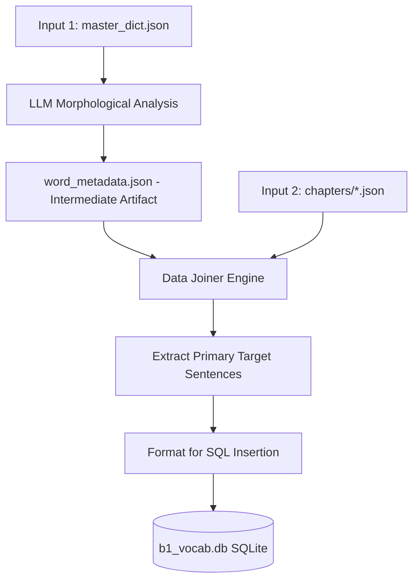

# Phase 3: Database Export (SQLite)

## 1. Overview

This phase (Phase 3) is responsible for two distinct steps:
1. **LLM Morphological Analysis**: Call an LLM to analyze every word in the vocabulary, detect its part of speech (POS), and extract the complete set of inflected forms (conjugations, declensions). The result is saved as an intermediate artifact `word_metadata.json`.
2. **Data Export**: Take the clean vocabulary from Phase 1, the morphological metadata from the intermediate artifact, and the rich contextual Swedish sentences from Phase 2, and export this combined dataset into a relational SQLite database.

Exporting to a database allows external systems, backend servers, and offline mobile clients to easily query the vocabulary with its official English translation, the exact context sentence where the learner will encounter the word in the reading material, the corresponding audio filename, and full morphological metadata (verb conjugations, noun gender, adjective declensions).



## 2. Input Specification

### 2.1 Primary Inputs
This phase requires outputs from the two preceding phases plus a newly generated intermediate artifact:
1.  **`master_dict.json`** (from Phase 1): Provides the authoritative `en` translation for every `base_form`.
2.  **`word_metadata.json`** (new intermediate artifact): Generated by `phase3_enrich_metadata.py` via LLM analysis. Contains POS tags, noun gender, verb conjugations, adjective declensions, and other morphological metadata for every word.
3.  **`chapters/*.json`** (from Phase 2): Provides the generated articles, specifically the `sv` sentences where each word was used as a primary target, and the associated audio filename.

### 2.2 Database Target
*   **File Path**: `courses/sfid/b1_vocab.db`
*   **Database Engine**: SQLite3

> [!IMPORTANT]
> Before running Phase 3 for the first time or on a fresh dataset, always create a backup of the existing `b1_vocab.db` to protect prior data. Only proceed after the backup is confirmed.

## 3. Database Schema

The target SQLite database consists of a single primary table named `b1_vocabulary`.

> [!WARNING]
> The schema strictly defines `word` as the `PRIMARY KEY`. This means if the script runs multiple times, it must perform an **UPSERT** (Update on Conflict) rather than a standard INSERT to avoid duplicate key errors.

```sql
CREATE TABLE IF NOT EXISTS b1_vocabulary (
    word                    TEXT PRIMARY KEY,
    word_type               TEXT,
    noun_gender             TEXT,
    is_regular_verb         BOOLEAN,
    verb_imperativ          TEXT,
    verb_presens            TEXT,
    verb_preteritum         TEXT,
    verb_supinum            TEXT,
    verb_perfekt_particip   TEXT,
    adj_en                  TEXT,
    adj_ett                 TEXT,
    adj_plural              TEXT,
    adj_komparativ          TEXT,
    adj_superlativ          TEXT,
    en_translation          TEXT NOT NULL,
    sv_context              TEXT NOT NULL,
    sentence_audio_filename TEXT,
    source                  TEXT NOT NULL
);
```

### 3.1 Field Definitions

**Core Fields:**
*   `word` (TEXT): The dictionary base form of the word (mapped from `base_form` in the JSONs).
*   `en_translation` (TEXT): The English translation (extracted directly from `master_dict.json`).
*   `sv_context` (TEXT): The complete Swedish sentence from Phase 2 where this word appeared as a primary target word.
*   `sentence_audio_filename` (TEXT): The audio filename for the context sentence (e.g., `art01_s001.mp3`). Only the filename is stored — **not the full path**, as the path may vary across environments.
*   `source` (TEXT): A tracking string to identify where the context sentence came from. **Default behavior: Use the `article_title` from the Phase 2 JSON.**

**Morphological Fields:**
*   `word_type` (TEXT): Part of speech — e.g., `verb`, `noun`, `adjective`, `adverb`, `other`.
*   `noun_gender` (TEXT): Noun article gender: `en` or `ett`. Only populated when `word_type = 'noun'`.
*   `is_regular_verb` (BOOLEAN): Whether the verb follows regular conjugation rules. Only populated when `word_type = 'verb'`.
*   `verb_imperativ` (TEXT): Verb imperative / stem form (e.g., `spring` for *springa*).
*   `verb_presens` (TEXT): Verb present tense (e.g., `springer`).
*   `verb_preteritum` (TEXT): Verb past tense (e.g., `sprang`).
*   `verb_supinum` (TEXT): Verb supine / perfect auxiliary form (e.g., `sprungit`).
*   `verb_perfekt_particip` (TEXT): Verb past participle (e.g., `sprungen`), used as an adjective.

**Adjective Sparse Columns** (zero storage cost for non-adjectives — SQLite stores `NULL` as 0 bytes):
*   `adj_en` (TEXT): Adjective form for `en`-gender nouns (indefinite singular).
*   `adj_ett` (TEXT): Adjective form for `ett`-gender nouns (indefinite singular).
*   `adj_plural` (TEXT): Adjective definite/plural form.
*   `adj_komparativ` (TEXT): Comparative form (e.g., `mindre`).
*   `adj_superlativ` (TEXT): Superlative form (e.g., `minst`).

### 3.2 Phrase Exemption Rule

> [!IMPORTANT]
> Words that are **multi-word phrases** (i.e., contain a space character, such as `ta fram`, `ha rätt`) must be treated as a special case. All morphological columns (`word_type` through `adj_superlativ`) must be set to `NULL` for phrases. Do NOT attempt to generate inflected forms for a phrase.

## 4. LLM Morphological Analysis (phase3_enrich_metadata.py)

This is a new sub-step that runs **before** the database export. Its sole purpose is to call an LLM to enrich every entry in `master_dict.json` with morphological data, producing the intermediate artifact `word_metadata.json`.

### 4.1 Processing Logic

1.  **Load** `master_dict.json` into memory.
2.  **Filter Phrases**: Immediately detect and flag any word containing a space character — these are multi-word phrases and must be skipped. Their `word_type` is set to `"phrase"` and all morphological fields are `null`.
3.  **Batch & Dispatch**: Group the remaining single-word entries into batches of ~50 words. Send each batch to the LLM for analysis. Use up to **3 concurrent workers** (but no worker may spawn further sub-agents).
4.  **LLM Prompt**: Instruct the LLM to determine for each word:
    *   `word_type`: one of `verb`, `noun`, `adjective`, `adverb`, `conjunction`, `preposition`, `other`.
    *   For **nouns**: `noun_gender` (`en` or `ett`), `noun_plural` (indefinite plural form).
    *   For **verbs**: `is_regular_verb` (true/false), and if present (especially for irregular verbs): `verb_imperativ`, `verb_presens`, `verb_preteritum`, `verb_supinum`, `verb_perfekt_particip`.
    *   For **adjectives**: `adj_en`, `adj_ett`, `adj_plural`, `adj_komparativ`, `adj_superlativ`.
5.  **Checkpoint Cache**: Save the JSON output for each completed batch immediately to disk (cache files), so the process can be resumed if interrupted without re-processing already-completed batches.
6.  **Merge**: Once all batches are complete, merge all cache files into the final `word_metadata.json`.

### 4.2 Pre-loop Filter: Clean Up Phrase Contamination

Before each new processing loop begins, the pipeline must scan the already-generated output and **remove any inflection data that was incorrectly generated for phrases**. If a phrase was accidentally assigned verb/noun/adjective fields, those fields must be cleared to `NULL` before the data is passed to the database export step.

## 5. Extraction and Joining Logic (phase3_export_db.py)

The script executing this phase must perform the following data join algorithm:

1.  **Initialize DB Connection**: Connect to `courses/sfid/b1_vocab.db` and ensure the table `b1_vocabulary` exists with the full schema defined in Section 3.
2.  **Load Data**: Load `master_dict.json` and `word_metadata.json` into memory as lookup tables.
3.  **Traverse Articles**: Loop through every generated article JSON file from Phase 2.
    *   For each `article`, extract the `article_title`.
    *   For each `sentence` within the article, iterate through its `target_words` array.
4.  **Filter for Primary Appearance**:
    *   Check if the `base_form` of the current target word exists in the article's `primary_words_used` array.
    *   **Crucial Step**: Only extract the `sv_context` for a word from the article where it is listed as a *primary* word. Do not extract context sentences where the word is merely a *secondary* reuse, as the primary sentence is specifically designed to teach the word.
5.  **Construct Record**:
    *   `word` = `base_form`
    *   `en_translation` = lookup `base_form` in `master_dict.json`
    *   Morphological fields = lookup `base_form` in `word_metadata.json`
    *   `sv_context` = `sv` (the Swedish sentence text)
    *   `sentence_audio_filename` = derive from `sentence_id` (e.g., `art01_s003.mp3`) — **filename only, no path**
    *   `source` = `article_title`
6.  **Execute Upsert**: Insert the record into the database using `ON CONFLICT` syntax.

## 6. SQL Execution Example

To safely insert the records and handle reruns of the pipeline, use the `INSERT OR REPLACE` or `ON CONFLICT` syntax.

### Python SQLite Example

```python
import sqlite3
import json

conn = sqlite3.connect('courses/sfid/b1_vocab.db')
cursor = conn.cursor()

# Create table if it doesn't exist
cursor.execute('''
    CREATE TABLE IF NOT EXISTS b1_vocabulary (
        word                    TEXT PRIMARY KEY,
        word_type               TEXT,
        noun_gender             TEXT,
        is_regular_verb         BOOLEAN,
        verb_imperativ          TEXT,
        verb_presens            TEXT,
        verb_preteritum         TEXT,
        verb_supinum            TEXT,
        verb_perfekt_particip   TEXT,
        adj_en                  TEXT,
        adj_ett                 TEXT,
        adj_plural              TEXT,
        adj_komparativ          TEXT,
        adj_superlativ          TEXT,
        en_translation          TEXT NOT NULL,
        sv_context              TEXT NOT NULL,
        sentence_audio_filename TEXT,
        source                  TEXT NOT NULL
    )
''')

# Upsert query
upsert_query = '''
    INSERT INTO b1_vocabulary (
        word, word_type, noun_gender, is_regular_verb,
        verb_imperativ, verb_presens, verb_preteritum, verb_supinum, verb_perfekt_particip,
        adj_en, adj_ett, adj_plural, adj_komparativ, adj_superlativ,
        en_translation, sv_context, sentence_audio_filename, source
    )
    VALUES (?, ?, ?, ?, ?, ?, ?, ?, ?, ?, ?, ?, ?, ?, ?, ?, ?, ?)
    ON CONFLICT(word) DO UPDATE SET
        word_type=excluded.word_type,
        noun_gender=excluded.noun_gender,
        is_regular_verb=excluded.is_regular_verb,
        verb_imperativ=excluded.verb_imperativ,
        verb_presens=excluded.verb_presens,
        verb_preteritum=excluded.verb_preteritum,
        verb_supinum=excluded.verb_supinum,
        verb_perfekt_particip=excluded.verb_perfekt_particip,
        adj_en=excluded.adj_en,
        adj_ett=excluded.adj_ett,
        adj_plural=excluded.adj_plural,
        adj_komparativ=excluded.adj_komparativ,
        adj_superlativ=excluded.adj_superlativ,
        en_translation=excluded.en_translation,
        sv_context=excluded.sv_context,
        sentence_audio_filename=excluded.sentence_audio_filename,
        source=excluded.source;
'''

cursor.executemany(upsert_query, records)
conn.commit()
conn.close()
```

## 7. Validation Rules

Before considering Phase 3 complete, verify the following:

1.  **Zero Data Loss (Row Count Match)**: The total number of rows in the `b1_vocabulary` table MUST exactly equal the total word count defined in the `master_dict.json` metadata. A difference of even 1 row is a hard failure. Words that are not verbs, nouns, or adjectives (e.g., prepositions, conjunctions) must still appear in the database — their morphological columns simply remain `NULL`.
2.  **No Nulls in Core Fields**: None of the mandatory columns (`en_translation`, `sv_context`, `source`) can contain NULL or empty string values.
3.  **Phrase Exemption Verified**: Randomly sample 5–10 multi-word phrases from the database and confirm that all morphological columns are `NULL`. No phrase should have verb or noun inflection data.
4.  **Morphological Spot-Check**: Randomly sample 10 verbs and 10 nouns from the database. Manually verify that their `verb_presens`, `verb_preteritum`, `noun_gender` etc. are linguistically correct Swedish inflections.
5.  **Audio Filename Spot-Check**: Randomly sample 20 words and verify that `sentence_audio_filename` is populated with a valid filename (e.g., `artXX_sYYY.mp3`) and does not contain any absolute path prefixes.
6.  **Database File Exists**: Ensure `courses/sfid/b1_vocab.db` is physically created and possesses a size `> 0` bytes.
