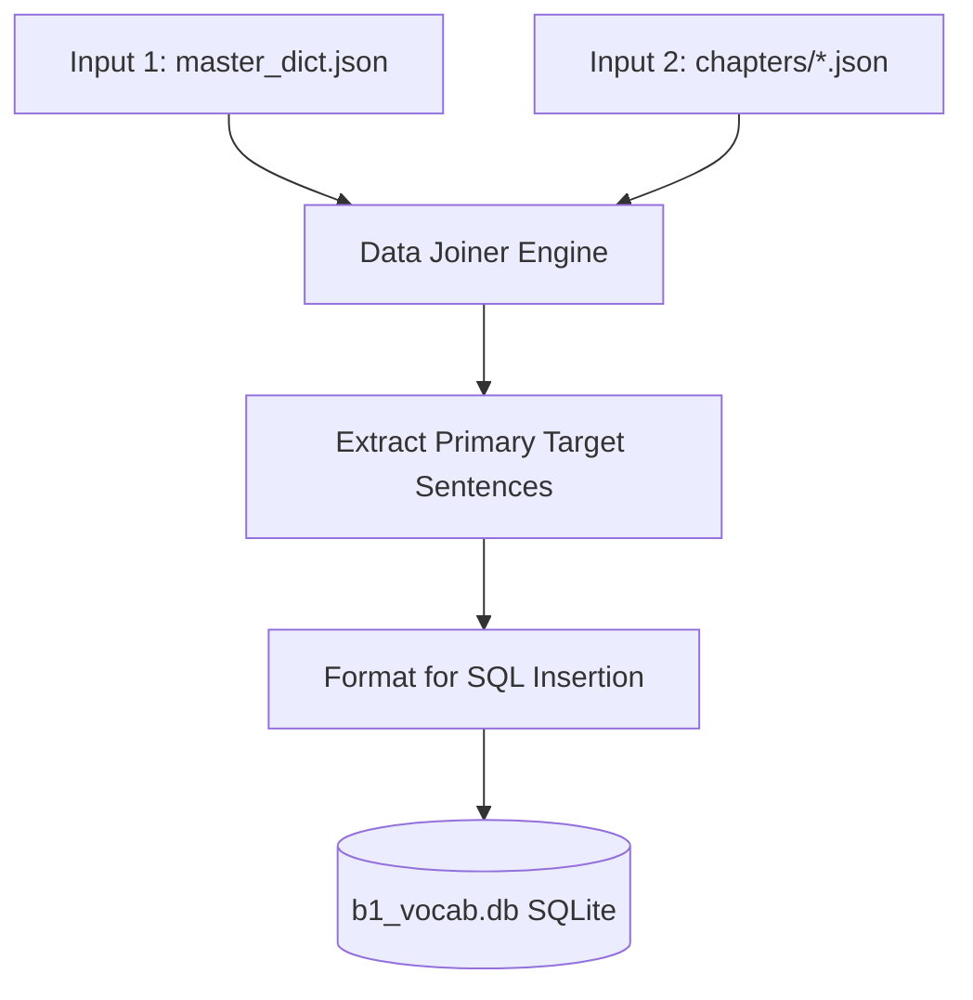

# Phase 3: Database Export (SQLite)

## 1. Overview

This phase (Phase 3) is responsible for taking the isolated, clean vocabulary from Phase 1 and pairing it with the rich, contextual Swedish sentences generated in Phase 2. This combined dataset is then exported to a relational SQLite database.

Exporting to a database allows external systems, backend servers, and offline mobile clients to easily query the vocabulary with its official English translation and the exact context sentence where the learner will encounter the word in the reading material.



## 2. Input Specification

### 2.1 Primary Inputs
This phase requires outputs from the two preceding phases:
1.  **`master_dict.json`** (from Phase 1): Provides the authoritative `en` translation for every `base_form`.
2.  **`chapters/*.json`** (from Phase 2): Provides the generated articles, specifically the `sv` sentences where each word was used as a primary target.

### 2.2 Database Target
*   **File Path**: `courses/sfid/b1_vocab.db`
*   **Database Engine**: SQLite3

## 3. Database Schema

The target SQLite database consists of a single primary table named `b1_vocabulary`.

> [!WARNING]
> The schema strictly defines `word` as the `PRIMARY KEY`. This means if the script runs multiple times, it must perform an **UPSERT** (Update on Conflict) rather than a standard INSERT to avoid duplicate key errors.

```sql
CREATE TABLE IF NOT EXISTS b1_vocabulary (
    word TEXT PRIMARY KEY,
    en_translation TEXT NOT NULL,
    sv_context TEXT NOT NULL,
    source TEXT NOT NULL
);
```

### 3.1 Field Definitions
*   `word` (TEXT): The dictionary base form of the word (mapped from `base_form` in the JSONs).
*   `en_translation` (TEXT): The English translation (extracted directly from `master_dict.json`).
*   `sv_context` (TEXT): The complete Swedish sentence from Phase 2 where this word appeared.
*   `source` (TEXT): A tracking string to identify where the context sentence came from. **Default behavior: Use the `article_title` from the Phase 2 JSON.**

## 4. Extraction and Joining Logic

The script executing this phase must perform the following data join algorithm:

1.  **Initialize DB Connection**: Connect to `courses/sfid/b1_vocab.db` and ensure the table `b1_vocabulary` exists.
2.  **Load Dictionary**: Load `master_dict.json` into memory as a lookup table (Key: `base_form`, Value: `en`).
3.  **Traverse Articles**: Loop through every generated article JSON file from Phase 2.
    *   For each `article`, extract the `article_title`.
    *   For each `sentence` within the article, iterate through its `target_words` array.
4.  **Filter for Primary Appearance**: 
    *   Check if the `base_form` of the current target word exists in the article's `primary_words_used` array.
    *   **Crucial Step**: Only extract the `sv_context` for a word from the article where it is listed as a *primary* word. Do not extract context sentences where the word is merely a *secondary* reuse, as the primary sentence is specifically designed to teach the word.
5.  **Construct Record**:
    *   `word` = `base_form`
    *   `en_translation` = lookup `base_form` in `master_dict.json`
    *   `sv_context` = `sv` (the Swedish sentence text)
    *   `source` = `article_title`
6.  **Execute Upsert**: Insert the record into the database.

## 5. SQL Execution Example

To safely insert the records and handle reruns of the pipeline, use the `INSERT OR REPLACE` or `ON CONFLICT` syntax.

### Python SQLite Example

```python
import sqlite3
import json

# Assuming `records` is a list of tuples: (word, en_translation, sv_context, source)
# Example: ("soffpotatis", "couch potato", "Min granne är en riktig soffpotatis...", "En dag på gymmet")

conn = sqlite3.connect('courses/sfid/b1_vocab.db')
cursor = conn.cursor()

# Create table if it doesn't exist
cursor.execute('''
    CREATE TABLE IF NOT EXISTS b1_vocabulary (
        word TEXT PRIMARY KEY,
        en_translation TEXT NOT NULL,
        sv_context TEXT NOT NULL,
        source TEXT NOT NULL
    )
''')

# Upsert query
upsert_query = '''
    INSERT INTO b1_vocabulary (word, en_translation, sv_context, source)
    VALUES (?, ?, ?, ?)
    ON CONFLICT(word) DO UPDATE SET
        en_translation=excluded.en_translation,
        sv_context=excluded.sv_context,
        source=excluded.source;
'''

cursor.executemany(upsert_query, records)
conn.commit()
conn.close()
```

## 6. Validation Rules

Before considering Phase 3 complete, verify the following:

1.  **Row Count Match**: The total number of rows in the `b1_vocabulary` table MUST exactly equal the `total_words` count defined in the `master_dict.json` metadata. This ensures 100% coverage.
2.  **No Nulls**: None of the columns (`en_translation`, `sv_context`, `source`) can contain NULL or empty string values.
3.  **Database File Exists**: Ensure `courses/sfid/b1_vocab.db` is physically created and possesses a size `> 0` bytes.
