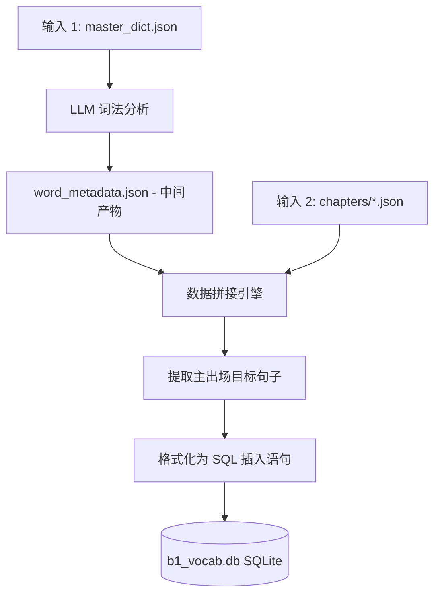

# Phase 3: 数据库导出 (SQLite)

## 1. 概述

本阶段 (Phase 3) 分为两个独立的子步骤：
1. **LLM 词法分析**：调用大模型对词汇表中的每一个单词进行分析，识别词性，并提取完整的变位/变格形式。结果保存为中间产物文件 `word_metadata.json`。
2. **数据导出**：将 Phase 1 中清洗出的词汇、中间产物中的词法元数据，以及 Phase 2 中生成的包含丰富上下文的瑞典语句子结合起来，导出至关系型 SQLite 数据库。

导出至数据库允许外部系统、后端服务器和离线移动客户端能够轻松查询词汇，并同时获取官方的英文翻译、学习者在阅读材料中遇到该词的精确上下文例句、对应的音频文件名以及完整的词法元数据（动词变位、名词词性、形容词变格）。



## 2. 输入规范

### 2.1 主要输入
此阶段需要前两个阶段的输出结果及新生成的中间产物：
1.  **`master_dict.json`** (来自 Phase 1): 为每个 `base_form` 提供权威的 `en` (英文) 翻译。
2.  **`word_metadata.json`** (新增中间产物): 通过 `phase3_enrich_metadata.py` 调用 LLM 生成，包含词性、名词词性、动词变位、形容词变格等额外元数据。
3.  **`chapters/*.json`** (来自 Phase 2): 提供生成的文章，特别是每个单词作为"主出场目标词"被使用时的 `sv` 瑞典语句子，以及对应的音频文件名。

### 2.2 数据库目标
*   **文件路径**: `courses/sfid/b1_vocab.db`
*   **数据库引擎**: SQLite3

> [!IMPORTANT]
> 在首次运行 Phase 3 或在全新数据集上运行之前，必须先对现有的 `b1_vocab.db` 进行备份，以保护先前的数据。只有在确认备份成功后，才能继续执行。

## 3. 数据库 Schema

目标 SQLite 数据库包含一个名为 `b1_vocabulary` 的主表。

> [!WARNING]
> 该 Schema 严格将 `word` 定义为 `PRIMARY KEY` (主键)。这意味着如果脚本被多次运行，必须执行 **UPSERT** (冲突时更新) 操作，而不是标准的 INSERT，以避免主键重复错误。

```sql
CREATE TABLE IF NOT EXISTS b1_vocabulary (
    word                    TEXT PRIMARY KEY,
    word_type               TEXT,
    noun_gender             TEXT,
    is_regular_verb         BOOLEAN,
    verb_imperativ          TEXT,
    verb_presens            TEXT,
    verb_preteritum         TEXT,
    verb_supinum            TEXT,
    verb_perfekt_particip   TEXT,
    adj_en                  TEXT,
    adj_ett                 TEXT,
    adj_plural              TEXT,
    adj_komparativ          TEXT,
    adj_superlativ          TEXT,
    en_translation          TEXT NOT NULL,
    sv_context              TEXT NOT NULL,
    sentence_audio_filename TEXT,
    source                  TEXT NOT NULL
);
```

### 3.1 字段定义

**核心字段：**
*   `word` (TEXT): 单词的字典基本形态 (映射自 JSON 中的 `base_form`)。
*   `en_translation` (TEXT): 英文翻译 (直接从 `master_dict.json` 提取)。
*   `sv_context` (TEXT): 单词在 Phase 2 中以"主出场词"身份出现时的完整瑞典语原句。
*   `sentence_audio_filename` (TEXT): 上下文例句对应的音频文件名 (例如 `art01_s001.mp3`)。**只存文件名，不存完整路径**，因为路径在不同环境下可能不同。
*   `source` (TEXT): 用于追踪上下文句子来源的字符串。**默认行为：使用 Phase 2 JSON 中的 `article_title`。**

**词法元数据字段：**
*   `word_type` (TEXT): 词性，例如 `verb`（动词）、`noun`（名词）、`adjective`（形容词）、`adverb`（副词）、`other`（其他）。
*   `noun_gender` (TEXT): 名词词性：`en` 或 `ett`。仅当 `word_type = 'noun'` 时填写。
*   `is_regular_verb` (BOOLEAN): 是否为规则动词。仅当 `word_type = 'verb'` 时填写。
*   `verb_imperativ` (TEXT): 动词命令式/词干形式（例如 *springa* 的命令式为 `spring`）。
*   `verb_presens` (TEXT): 动词现在时 (例如 `springer`)。
*   `verb_preteritum` (TEXT): 动词过去时 (例如 `sprang`)。
*   `verb_supinum` (TEXT): 动词完成体，与 har/hade 连用 (例如 `sprungit`)。
*   `verb_perfekt_particip` (TEXT): 动词过去分词，常用作形容词 (例如 `sprungen`)。

**形容词稀疏列**（对于非形容词词条，这些列存储 `NULL`，在 SQLite 底层**占用 0 字节存储空间**）：
*   `adj_en` (TEXT): 形容词修饰 `en` 词性名词的形式（不定式单数）。
*   `adj_ett` (TEXT): 形容词修饰 `ett` 词性名词的形式（不定式单数）。
*   `adj_plural` (TEXT): 形容词定式/复数形式。
*   `adj_komparativ` (TEXT): 形容词比较级 (例如 `mindre`)。
*   `adj_superlativ` (TEXT): 形容词最高级 (例如 `minst`)。

### 3.2 词组豁免规则

> [!IMPORTANT]
> **含有空格的多词词组**（例如 `ta fram`、`ha rätt`）必须作为特殊情况处理。这些词组的所有词法列（从 `word_type` 到 `adj_superlativ`）必须统一设为 `NULL`。**绝对不能**为词组生成变位/变格形式。

## 4. LLM 词法分析子步骤 (phase3_enrich_metadata.py)

这是一个在数据库导出**之前**运行的全新子步骤，其唯一职责是调用大模型对 `master_dict.json` 中的每个词条进行词法分析，并生成中间产物 `word_metadata.json`。

### 4.1 处理逻辑

1.  **加载** `master_dict.json` 到内存。
2.  **过滤词组**：立即识别并标记所有含有空格的词条——这些是多词词组，必须跳过，其 `word_type` 设为 `"phrase"`，所有词法字段设为 `null`。
3.  **分批派发**：将剩余的单词条目分组（每组约 50 个词），发送给大模型进行分析。最多使用 **3 个并发 Worker**，且任何 Worker 都不允许再唤起子 Agent。
4.  **LLM Prompt 要求**：指示大模型为每个单词确定：
    *   `word_type`：`verb`、`noun`、`adjective`、`adverb`、`conjunction`、`preposition`、`other` 中的一种。
    *   对于**名词**：`noun_gender`（`en` 或 `ett`），以及名词不定复数形式。
    *   对于**动词**：`is_regular_verb`（true/false）。对于不规则动词（或需要额外记忆的规则动词），同时生成 `verb_imperativ`、`verb_presens`、`verb_preteritum`、`verb_supinum`、`verb_perfekt_particip`。
    *   对于**形容词**：`adj_en`、`adj_ett`、`adj_plural`、`adj_komparativ`、`adj_superlativ`。
5.  **断点缓存**：每完成一个批次，立即将该批次的 JSON 结果保存到磁盘缓存文件中，以便进程中断后可以从断点续跑，无需重新处理已完成的批次。
6.  **合并**：所有批次完成后，将所有缓存文件合并为最终的 `word_metadata.json`。

### 4.2 每轮循环前的预过滤清理

在进入下一轮处理循环之前，流水线必须扫描已生成的输出，**清除任何被错误地生成了变形数据的词组条目**。如果某个词组被意外地赋予了动词或名词变形字段，必须在数据传入数据库导出脚本之前，将这些字段清空为 `NULL`。

## 5. 提取与拼接逻辑 (phase3_export_db.py)

执行此阶段的脚本必须执行以下数据拼接算法：

1.  **初始化 DB 连接**: 连接到 `courses/sfid/b1_vocab.db` 并确保 `b1_vocabulary` 表以第 3 节定义的完整 Schema 存在。
2.  **加载数据**: 将 `master_dict.json` 和 `word_metadata.json` 加载到内存中，作为查找表备用。
3.  **遍历文章**: 循环遍历 Phase 2 生成的所有文章 JSON 文件。
    *   对于每个 `article`，提取 `article_title`。
    *   对于文章内的每个 `sentence`，迭代其 `target_words` 数组。
4.  **过滤主出场词汇**: 
    *   检查当前目标词的 `base_form` 是否存在于文章的 `primary_words_used` 数组中。
    *   **关键步骤**：只有当一个词在该文章中被列为*主出场词汇 (primary word)* 时，才提取其 `sv_context`。不要提取该词作为*自然复现 (secondary reuse)* 时的句子，因为主出场句子是专门为了教授该词而设计的。
5.  **构建记录**:
    *   结合基本信息 (`base_form`)、`master_dict.json` 中的英文翻译以及 `word_metadata.json` 中的词法元数据。
    *   获取该词对应的目标句子 `sv_context`。
    *   生成并关联 `sentence_audio_filename`（例如 `art01_s001.mp3`）——**仅文件名，不含路径**。
    *   `source` = `article_title`
6.  **执行 Upsert**: 将包含所有字段的记录插入数据库。

## 6. SQL 执行示例

为了安全地插入记录并处理管线的重复运行，请使用 `INSERT OR REPLACE` 或 `ON CONFLICT` 语法。

### Python SQLite 示例

```python
import sqlite3
import json

conn = sqlite3.connect('courses/sfid/b1_vocab.db')
cursor = conn.cursor()

# 如果表不存在则创建（完整 Schema）
cursor.execute('''
    CREATE TABLE IF NOT EXISTS b1_vocabulary (
        word                    TEXT PRIMARY KEY,
        word_type               TEXT,
        noun_gender             TEXT,
        is_regular_verb         BOOLEAN,
        verb_imperativ          TEXT,
        verb_presens            TEXT,
        verb_preteritum         TEXT,
        verb_supinum            TEXT,
        verb_perfekt_particip   TEXT,
        adj_en                  TEXT,
        adj_ett                 TEXT,
        adj_plural              TEXT,
        adj_komparativ          TEXT,
        adj_superlativ          TEXT,
        en_translation          TEXT NOT NULL,
        sv_context              TEXT NOT NULL,
        sentence_audio_filename TEXT,
        source                  TEXT NOT NULL
    )
''')

# Upsert 查询
upsert_query = '''
    INSERT INTO b1_vocabulary (
        word, word_type, noun_gender, is_regular_verb,
        verb_imperativ, verb_presens, verb_preteritum, verb_supinum, verb_perfekt_particip,
        adj_en, adj_ett, adj_plural, adj_komparativ, adj_superlativ,
        en_translation, sv_context, sentence_audio_filename, source
    )
    VALUES (?, ?, ?, ?, ?, ?, ?, ?, ?, ?, ?, ?, ?, ?, ?, ?, ?, ?)
    ON CONFLICT(word) DO UPDATE SET
        word_type=excluded.word_type,
        noun_gender=excluded.noun_gender,
        is_regular_verb=excluded.is_regular_verb,
        verb_imperativ=excluded.verb_imperativ,
        verb_presens=excluded.verb_presens,
        verb_preteritum=excluded.verb_preteritum,
        verb_supinum=excluded.verb_supinum,
        verb_perfekt_particip=excluded.verb_perfekt_particip,
        adj_en=excluded.adj_en,
        adj_ett=excluded.adj_ett,
        adj_plural=excluded.adj_plural,
        adj_komparativ=excluded.adj_komparativ,
        adj_superlativ=excluded.adj_superlativ,
        en_translation=excluded.en_translation,
        sv_context=excluded.sv_context,
        sentence_audio_filename=excluded.sentence_audio_filename,
        source=excluded.source;
'''

cursor.executemany(upsert_query, records)
conn.commit()
conn.close()
```

## 7. 校验规则

在认定 Phase 3 完成之前，验证以下内容：

1.  **零数据遗漏 (行数绝对匹配)**：`b1_vocabulary` 表中的总行数必须**完全等于** `master_dict.json` 元数据中定义的词汇总数。哪怕差一行都属于硬性失败。介词、副词、连词等不需要变形的词，也必须完整出现在数据库中——它们的词法列保持 `NULL` 即可，但词条本身绝不能丢失。
2.  **核心字段无空值 (No Nulls)**：`en_translation`、`sv_context`、`source` 列中不能有 NULL 或空字符串值。
3.  **词组豁免验证**：从数据库中随机抽取 5-10 个多词词组，确认它们的所有词法列均为 `NULL`。不允许出现任何词组被赋予了变形数据的情况。
4.  **词法数据抽样校验**：随机抽取 10 个动词和 10 个名词，人工验证其 `verb_presens`、`verb_preteritum`、`noun_gender` 等字段是否为语法正确的瑞典语变形。
5.  **音频文件名抽样校验**：随机抽取 20 个词，确认 `sentence_audio_filename` 已填写有效的文件名（例如 `artXX_sYYY.mp3`），且不包含任何绝对路径前缀。
6.  **数据库文件存在**: 确保物理文件 `courses/sfid/b1_vocab.db` 成功创建，且文件大小 `> 0` 字节。
