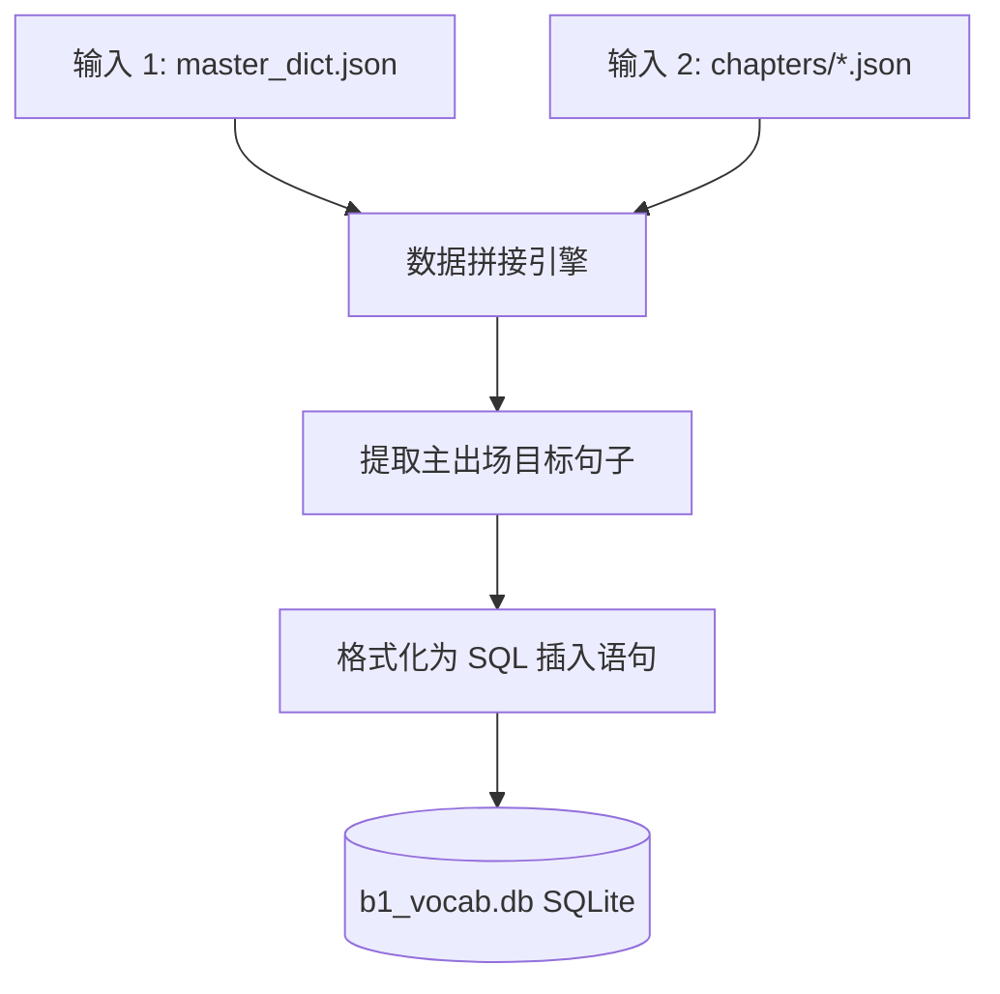

# Phase 3: 数据库导出 (SQLite)

## 1. 概述

本阶段 (Phase 3) 负责将 Phase 1 中清洗出的独立词汇与 Phase 2 中生成的包含丰富上下文的瑞典语句子结合起来。合并后的数据集将被导出至一个关系型 SQLite 数据库中。

导出至数据库允许外部系统、后端服务器和离线移动客户端能够轻松查询词汇，并同时获取官方的英文翻译以及学习者在阅读材料中遇到该词的精确上下文例句。



## 2. 输入规范

### 2.1 主要输入
此阶段需要前两个阶段的输出结果：
1.  **`master_dict.json`** (来自 Phase 1): 为每个 `base_form` 提供权威的 `en` (英文) 翻译。
2.  **`chapters/*.json`** (来自 Phase 2): 提供生成的文章，特别是每个单词作为“主出场目标词”被使用时的 `sv` 瑞典语句子。

### 2.2 数据库目标
*   **文件路径**: `courses/sfid/b1_vocab.db`
*   **数据库引擎**: SQLite3

## 3. 数据库 Schema

目标 SQLite 数据库包含一个名为 `b1_vocabulary` 的主表。

> [!WARNING]
> 该 Schema 严格将 `word` 定义为 `PRIMARY KEY` (主键)。这意味着如果脚本被多次运行，必须执行 **UPSERT** (冲突时更新) 操作，而不是标准的 INSERT，以避免主键重复错误。

```sql
CREATE TABLE IF NOT EXISTS b1_vocabulary (
    word TEXT PRIMARY KEY,
    en_translation TEXT NOT NULL,
    sv_context TEXT NOT NULL,
    source TEXT NOT NULL
);
```

### 3.1 字段定义
*   `word` (TEXT): 单词的字典基本形态 (映射自 JSON 中的 `base_form`)。
*   `en_translation` (TEXT): 英文翻译 (直接从 `master_dict.json` 提取)。
*   `sv_context` (TEXT): 单词出现时的完整瑞典语原句 (来自 Phase 2)。
*   `source` (TEXT): 用于追踪上下文句子来源的字符串。**默认行为：使用 Phase 2 JSON 中的 `article_title`。**

## 4. 提取与拼接逻辑

执行此阶段的脚本必须执行以下数据拼接算法：

1.  **初始化 DB 连接**: 连接到 `courses/sfid/b1_vocab.db` 并确保 `b1_vocabulary` 表存在。
2.  **加载词典**: 将 `master_dict.json` 加载到内存作为查找表 (Key: `base_form`, Value: `en`)。
3.  **遍历文章**: 循环遍历 Phase 2 生成的所有文章 JSON 文件。
    *   对于每个 `article`，提取 `article_title`。
    *   对于文章内的每个 `sentence`，迭代其 `target_words` 数组。
4.  **过滤主出场词汇**: 
    *   检查当前目标词的 `base_form` 是否存在于文章的 `primary_words_used` 数组中。
    *   **关键步骤**：只有当一个词在该文章中被列为*主出场词汇 (primary word)* 时，才提取其 `sv_context`。不要提取该词作为*自然复现 (secondary reuse)* 时的句子，因为主出场句子是专门为了教授该词而设计的。
5.  **构建记录**:
    *   `word` = `base_form`
    *   `en_translation` = 在 `master_dict.json` 中查找 `base_form`
    *   `sv_context` = `sv` (瑞典语句子文本)
    *   `source` = `article_title`
6.  **执行 Upsert**: 将记录插入数据库。

## 5. SQL 执行示例

为了安全地插入记录并处理管线的重复运行，请使用 `INSERT OR REPLACE` 或 `ON CONFLICT` 语法。

### Python SQLite 示例

```python
import sqlite3
import json

# 假设 `records` 是一个元组列表: (word, en_translation, sv_context, source)
# 例如: ("soffpotatis", "couch potato", "Min granne är en riktig soffpotatis...", "En dag på gymmet")

conn = sqlite3.connect('courses/sfid/b1_vocab.db')
cursor = conn.cursor()

# 如果表不存在则创建
cursor.execute('''
    CREATE TABLE IF NOT EXISTS b1_vocabulary (
        word TEXT PRIMARY KEY,
        en_translation TEXT NOT NULL,
        sv_context TEXT NOT NULL,
        source TEXT NOT NULL
    )
''')

# Upsert 查询
upsert_query = '''
    INSERT INTO b1_vocabulary (word, en_translation, sv_context, source)
    VALUES (?, ?, ?, ?)
    ON CONFLICT(word) DO UPDATE SET
        en_translation=excluded.en_translation,
        sv_context=excluded.sv_context,
        source=excluded.source;
'''

cursor.executemany(upsert_query, records)
conn.commit()
conn.close()
```

## 6. 校验规则

在认定 Phase 3 完成之前，验证以下内容：

1.  **行数匹配**: `b1_vocabulary` 表中的总行数必须**完全等于** `master_dict.json` 元数据中定义的 `total_words` 数量。这确保了 100% 的覆盖率。
2.  **无空值 (No Nulls)**: `en_translation`、`sv_context`、`source` 列中不能有 NULL 或空字符串值。
3.  **数据库文件存在**: 确保物理文件 `courses/sfid/b1_vocab.db` 成功创建，且文件大小 `> 0` 字节。
