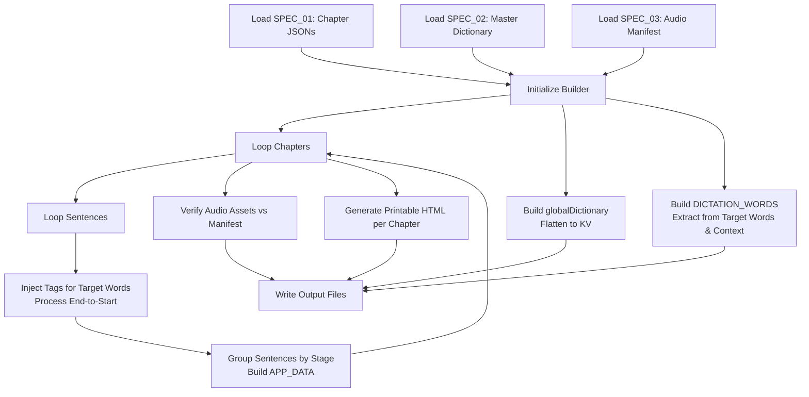

# Phase 4: Frontend Data Assembly & Integration (前端数据组装与集成规范)

## 1. 概述 (Overview)

本阶段 (Phase 4) 负责将前三个阶段 (Phase 1-3) 的所有输出组装成前端应用可直接加载的数据文件。其主要目标是将结构化的 JSON 数据转化为当前 Web 应用所依赖的精确 JavaScript 对象格式，并生成用于离线学习的打印版 HTML 资料。

> [!NOTE]
> 本阶段**不**实现 FSRS (Free Spaced Repetition Scheduler) 的核心逻辑，而是专注于数据的兼容性和准确性，确保组装后的数据能够无缝对接到前端现有的 FSRS 引擎 (`fsrs_engine.js`) 及其他组件中。

## 2. 输入规范 (Input Specification)

前端数据组装流水线依赖以下输入：

- **来自 SPEC_01 的数据**: 各个章节的 JSON 文件数组，包含文章、句子（`sentences`）以及目标词汇（`target_words`）的详细位置信息。
- **来自 SPEC_02 的数据**: 主词典 JSON 文件（Master dictionary），包含词汇的详尽释义。
- **来自 SPEC_03 的数据**: 音频清单文件（Audio manifest JSON）及相应的音频文件。

### 2.1 参数配置 (Parameters)

转换过程支持以下参数化配置：

| 参数名称 | 类型 | 默认值 | 描述 |
| --- | --- | --- | --- |
| `course_id` | `string` | `"rivstart_b1"` | 课程的唯一标识符。 |
| `stage_mapping` | `object` | 需提供 | 章节到阶段的映射规则（例如：章节 1-5 映射为 "Stage 1"）。 |
| `highlight_tag` | `string` | `"strong"` | 目标词汇在前端渲染时使用的 HTML 标签。 |
| `highlight_class` | `string` | `null` | 目标词汇标签的 CSS 类名（默认无，直接使用标签选择器）。 |
| `output_dir` | `string` | `"web_app/"` | 输出文件的目标目录。 |

## 3. 单词高亮机制 (Word Highlighting)

在渲染文章内容时，需要精确定义目标词汇（Target Words）在瑞典语原文（`sv`）中的高亮和标记方式。

### 3.1 当前方案 (Current - Recommended for Compatibility)

为了保持与现有前端 HTML/CSS/JS 架构的完全兼容，建议继续使用 `<strong>` 标签包裹目标词汇。

- 现有的 CSS 已经对 `strong` 标签应用了强调色（`var(--accent-color)`）和粗体（`font-weight: 600;`）。
- **处理算法 (Algorithm)**:
  1. 获取原始的瑞典语 `sv` 句子文本。
  2. 针对当前句子中的每个 `target_word` 条目，利用其提供的 `position_start` 和 `position_end`。
  3. **倒序遍历**（从句末到句首处理，防止插入 HTML 标签后改变后续单词的索引位置）。
  4. 将截取出的目标单词 `{word_in_sentence}` 替换为 `<strong>base_form="{base_form}">{word_in_sentence}</strong>`。
  5. 附加 `base_form` 属性，以便在前端点击时，可以通过此属性在 `globalDictionary` 中进行查词。

> [!WARNING]
> **索引偏移问题**：如果有多个词汇需要高亮，必须从后往前（基于索引倒序）进行字符串替换，以确保之前记录的 `position_start` 不会因为插入 HTML 标签而失效。

### 3.2 改进方案 (Future Enhancement)

未来为了增强互动性和数据追踪能力，可采用 `<span>` 标签携带更多元数据的方案：

- 使用 `<span class="target-word" data-base="{base_form}" data-word-id="{unique_id}">` 替代 `<strong>`。
- **赋能特性**:
  - **真正的划词翻译**: 点击 `.target-word` 元素时，前端事件监听器可拦截点击，读取 `data-base` 并从 `globalDictionary` 提取翻译，显示为浮动弹窗 (Popup)。
  - **语境阅读追踪**: 记录用户在特定语境中已阅读过哪些词汇。
  - **上下文复习 (In-context Review)**: 直接将此词汇及所在句子推送至 FSRS 复习队列。

## 4. 输出文件规范 (Output File Specifications)

组装流水线将生成以下文件，直接供前端加载。

### 4.1 `data.js` (APP_DATA)

包含文章、阶段与句子的层级树状数据。

```javascript
// data.js
const APP_DATA = {
  "rivstart_b1": {
    "Stage 1": {
      "Kapitel 1: Sport och hälsa": [
        {
          "id": "ch01_s001",
          "sv": "Min granne är en riktig <strong base_form=\"soffpotatis\">soffpotatis</strong> som aldrig <strong base_form=\"träna\">tränar</strong>.",
          "en": "My neighbor is a real couch potato who never exercises."
        }
      ]
    }
  }
};

export { APP_DATA }; // 或根据当前应用规范设为 window.APP_DATA
```

### 4.2 `global_dict.js` (globalDictionary)

全量词典的扁平化键值对，用于快速查词。键为 `base_form`。

```javascript
// global_dict.js
const globalDictionary = {
  "soffpotatis": "couch potato",
  "träna": "exercise, work out",
  "granne": "neighbor"
};

export { globalDictionary };
```

### 4.3 `dictation_data.js` (DICTATION_WORDS)

用于听写练习和 FSRS 闪卡模块的数据数组。

```javascript
// dictation_data.js
const DICTATION_WORDS = [
  {
    "sv": "soffpotatis",
    "en": "couch potato",
    "context_sv": "Min granne är en riktig soffpotatis som aldrig tränar.",
    "course_id": "rivstart_b1",
    "stage": "Stage 1",
    "article": "Kapitel 1: Sport och hälsa"
  },
  {
    "sv": "träna",
    "en": "exercise, work out",
    "context_sv": "Min granne är en riktig soffpotatis som aldrig tränar.",
    "course_id": "rivstart_b1",
    "stage": "Stage 1",
    "article": "Kapitel 1: Sport och hälsa"
  }
];

export { DICTATION_WORDS };
```

### 4.4 打印版 HTML (Printable HTML)

为方便线下学习，为每个章节生成一个静态 HTML 文件（例如 `rivstart_b1_ch01.html`）。

- **CSS `@media print`**：包含专门的打印样式。
- **页面布局**:
  - **页眉 (Header)**: 章节标题 (Chapter Title) 和课程级别 (Course Level)。
  - **主体 (Body)**: 带编号的句子列表，采用双列布局（左侧为瑞典语原文，右侧为英语译文）。瑞典语中的目标词汇需加粗显示。
  - **附录 (Footer/Appendix)**: 当前章节的生词表（瑞典语单词 → 英文释义）。
- **页面规格**: A4 尺寸，正文采用 12pt 衬线字体 (Serif)，标题采用 14pt 无衬线字体 (Sans-serif)。

## 5. FSRS 数据接口预留 (FSRS Interface Reservation)

目前的 `dictation_data.js` 格式已经与前端的 FSRS 引擎 (`fsrs_engine.js`) 兼容。`flashcard.js` 能够读取 `DICTATION_WORDS` 并在用户交互后调用 `window.FSRS_ENGINE.recordReview(sv, rating)`。

为了确保长期兼容性和无缝集成：
1. 文章中标记的**每一个目标词汇 (target word)**，都**必须**在 `DICTATION_WORDS` 中有一个对应的条目。
2. `DICTATION_WORDS` 中的 `sv` 字段必须是该词的**基本形式 (base_form / dictionary form)**，以确保全局学习记录的一致性。
3. `context_sv` 字段必须包含该词所在的原始句子，为听写和闪卡提供语境支持。

> [!TIP]
> **未来演进**: 建议在 `DICTATION_WORDS` 数组元素中新增 `word_id` 字段，以支持跨课程或跨章节的统一 FSRS 词汇身份识别，避免同形异义词造成的复习调度冲突。

## 6. 数据转换算法 (Transformation Algorithm)

以下是用于将前序阶段输出转换为前端所需文件的步骤：



**逐步算法说明**:
1. 加载 SPEC_01 中的所有章节 JSON。
2. 加载 SPEC_02 中的主词典 JSON。
3. 加载 SPEC_03 中的音频清单。
4. **遍历每个章节**:
   - **遍历每个句子**:
     - 基于目标词汇位置，倒序注入 `<strong>` 标签。
   - 根据预定义的 `stage_mapping`，将句子进行分组。
   - 填充并构建 `APP_DATA` 的相应层级结构。
5. **构建全局词典**: 将主词典数据扁平化，生成 `{ "base_form": "translation" }` 结构的 `globalDictionary`。
6. **构建听写词库**: 遍历所有章节的目标词汇，结合对应的句子上下文（`context_sv`），生成 `DICTATION_WORDS` 数组。
7. **校验资产**: 验证 `APP_DATA` 和 `DICTATION_WORDS` 中引用的所有音频文件，是否在硬盘上真实存在（参照音频清单）。
8. **生成 HTML**: 根据转换后的句子数据与词汇数据，生成用于打印的章节 HTML 文件。
9. **写入磁盘**: 输出所有生成的 `.js` 和 `.html` 文件。

## 7. 校验规则 (Validation Rules)

在写入输出文件之前，必须执行以下数据完整性检查：

- **词典闭环**: `DICTATION_WORDS` 中出现的所有单词 `sv`（基于基本形式），都必须存在于 `globalDictionary` 中。
- **句子音频完备**: `APP_DATA` 中的每一个 `sentence_id` 都必须有对应存在的句子音频文件。
- **单词音频完备**: `DICTATION_WORDS` 中的每一个单词都必须有对应存在的单词音频文件。
- **HTML 格式安全**: `sv` 字符串中注入的 HTML 标签必须完全闭合有效（不能出现截断的标签）。
- **层级一致性**: 所有记录中的 `course_id` 必须与应用配置保持一致。
- **打印版验证**: 生成的 HTML 必须在无外部 JS 的情况下，能够在 Chrome 的打印预览中正常渲染双列排版及附录。

## 8. 打印样式详细规范 (Print Stylesheet Specification)

下面是打印版 HTML 所需的核心 CSS `@media print` 规范：

```css
@media print {
  /* 页面设置 */
  @page {
    size: A4;
    margin: 20mm;
    @bottom-center {
      content: counter(page);
    }
  }

  /* 基础排版 */
  body {
    font-family: 'Times New Roman', Times, serif;
    font-size: 12pt;
    line-height: 1.5;
    color: #000;
    background: #fff;
  }

  h1, h2, h3 {
    font-family: Arial, Helvetica, sans-serif;
    page-break-after: avoid;
  }
  
  h1 { font-size: 14pt; border-bottom: 1px solid #000; padding-bottom: 4px; }

  /* 强制章节分页 */
  .chapter-container {
    page-break-before: always;
  }
  
  .chapter-container:first-of-type {
    page-break-before: avoid;
  }

  /* 双列布局 (瑞典语 / 英语) */
  .sentence-row {
    display: flex;
    flex-direction: row;
    margin-bottom: 10px;
    page-break-inside: avoid; /* 防止单行句子被跨页截断 */
  }

  .sentence-sv, .sentence-en {
    flex: 1;
    padding: 0 10px;
  }

  .sentence-sv strong {
    font-weight: bold;
    /* 打印时不使用颜色，纯依赖加粗 */
  }

  /* 词汇附录表格 */
  .vocab-appendix {
    margin-top: 30px;
    border-collapse: collapse;
    width: 100%;
    page-break-before: auto;
  }

  .vocab-appendix th, .vocab-appendix td {
    border: 1px solid #ccc;
    padding: 6px;
    text-align: left;
  }
}
```

## 9. 错误处理 (Error Handling)

数据流水线在组装过程中如果遇到异常，应采取如下策略：

- **音频文件缺失 (Missing audio files)**: 
  - 记录一个 `WARNING` 级别日志，指出缺失的音频 ID。
  - 在输出的 JSON/JS 数据中保留该音频的引用路径占位符，前端检测到文件不存在时应平滑回退（静音或隐藏播放按钮）。
- **缺少词汇翻译 (Missing translations)**: 
  - 如果目标词汇在主词典中找不到翻译，回退为**空字符串 (`""`)**。
  - 记录一个 `ERROR` 级别日志，提示需要人工介入更新 SPEC_02 数据。
- **无效的位置索引 (Invalid position indices)**: 
  - 如果提供的 `position_start` 和 `position_end` 与句子字符串内容不符（如切片截取后不是一个完整的单词），应放弃使用硬编码索引。
  - 启动容错机制：在当前句子文本中，直接执行目标单词的字符串匹配搜索（Text Search / Regex），重新计算索引并记录日志。

> [!CAUTION]
> 当使用文本搜索重新匹配单词索引时，如果句子中存在多个相同的单词，可能会高亮错误的实例。建议在日志中专门标记此类重算行为以供审核。
