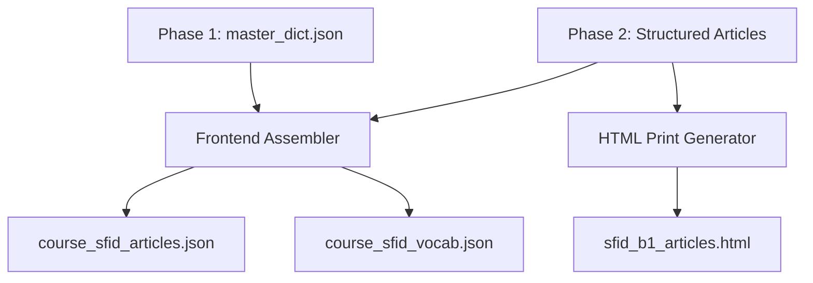

# Phase 5: Frontend Data Assembly & HTML Printing

## 1. Overview

This final phase prepares the generated data for consumption by the end-user facing systems: the web application and physical printouts.

The pipeline takes the outputs from Phase 1 (Master Dictionary) and Phase 2 (Article JSONs) to generate static JavaScript data files that the frontend application loads. It also takes the generated articles and compiles them into a printable HTML file formatted specifically for A4 paper.



### 2. Frontend Data Interfaces (Abstract Datasets)

To ensure the frontend application is decoupled from backend specific technologies and can be deployed anywhere (local, cloud, or app), the Phase 5 output MUST consist of pure, abstract JSON datasets. **No hardcoded `.js` variable injection is allowed.**

### 2.1 Static Article Dataset
The generated articles from Phase 2 must be assembled into a single JSON dataset mirroring the **Course -> Stage -> Article** hierarchy.

**Output Specification (`course_sfid_articles.json`):**
```json
{
  "course_id": "sfid",
  "course_title": "SFI D",
  "stages": [
    {
      "stage_id": "stage_01",
      "stage_title": "Daily Life and Health",
      "articles": [
        {
          "article_id": "art01",
          "article_title": "En dag på gymmet",
          "sentences": [
            {
              "sentence_id": "art01_s001",
              "sv": "Min granne är en riktig soffpotatis som aldrig tränar.",
              "en": "My neighbor is a real couch potato who never exercises.",
              "target_words": [
                {
                  "word_in_sentence": "soffpotatis",
                  "base_form": "soffpotatis",
                  "contextual_en": "couch potato",
                  "position_start": 25,
                  "position_end": 36
                }
              ]
            }
          ]
        }
      ]
    }
  ]
}
```

### 2.2 Static Contextual Vocabulary Dataset
Phase 5 must extract all `target_words` and `secondary_words` from all articles, merge them with the translations from `master_dictionary.json`, and output a unified, flat array of **Word Objects**. This dataset serves as the pre-compiled "ammunition" for frontend learning queues.

**The Universal `Word Object` Schema:**
This is the atomic data unit used across the entire frontend ecosystem.
```json
[
  {
    "base_form": "springa",
    "word_in_sentence": "sprang",
    "en_translation": "run",
    "contextual_en": "ran",
    "stage_id": "stage_01",
    "article_id": "art01",
    "sentence_id": "art01_s001"
  }
]
```

**Field Descriptions:**

| Field | Source | Notes |
|---|---|---|
| `base_form` | `master_dictionary.json` & Phase 2 | The dictionary root form (Primary Key). |
| `word_in_sentence`| Phase 2 Article | The exact inflected form used in the text. |
| `en_translation` | `master_dictionary.json` | The global/general dictionary translation. |
| `contextual_en` | Phase 2 Article | The precise in-context translation for this specific usage. |
| `stage_id` | Phase 5 Assembler | Hierarchy index 1 (e.g., `stage_01`). |
| `article_id` | Phase 5 Assembler | Hierarchy index 2 (e.g., `art01`). |
| `sentence_id` | Phase 5 Assembler | Hierarchy index 3 (e.g., `art01_s001`). |

*(Output file: `course_sfid_vocab.json`)*

## 3. Web App UI & FSRS Logic

The frontend web application processes these abstract JSON datasets to provide an interactive reading experience and integrate with the Spaced Repetition System (FSRS).

### 3.1 Learning Queue & Word Storage Architecture

To ensure high-quality spaced repetition and correct data lifecycle management, the system implements **two separate data stores**. Both stores MUST strictly use the **Universal Word Object** schema (the 8 fields defined above).

#### Store A: Temporary Learning Queue
A lightweight data store used as an **in-progress learning queue**. Words are placed here when the user starts learning a set, and are permanently **deleted** once the word has been mastered (passed the double threshold).

*   **Data Source**: When a learning session begins, the frontend directly **COPIES** the fully populated `Word Objects` belonging to that article from the Static Contextual Vocabulary Dataset into Store A.
*   **Double Threshold (Removal Rule)**: A word is deleted from Store A once it passes both:
    *   ✅ **Dictation Mode**: 100% correct
    *   ✅ **Flashcard Translation Mode**: 100% correct

#### Store B: Permanent Custom Vocabulary
A permanent data store for **user-defined custom words**—words that do not exist in the course syllabus but the user manually highlighted or added. This store is **never pruned** after mastery.

*   **Data Source**: User instantiation. The frontend creates a new `Word Object`.
*   **Field Population**:
    *   `base_form` and `word_in_sentence` are set to the exact string the user clicked (since no LLM is present to determine the base form).
    *   `en_translation` MUST be manually typed by the user.
    *   `contextual_en` is `null` (the system cannot infer it).
    *   If added while reading an article, the 3-level IDs (`stage_id`, `article_id`, `sentence_id`) are automatically populated from the context. Otherwise, they are `null`.

### 3.2 UI Rendering & Testing Logic (The Single Source of Truth)
Because Store A, Store B, and the Static Vocabulary Dataset all use the exact same `Word Object` schema, the frontend UI logic is completely unified:
1.  **Testing (Dictation/Flashcards)**: The ONLY standard for a correct answer is matching the `word_in_sentence` field.
2.  **Displaying Translation**: The UI prioritizes showing `contextual_en`. If it is `null` (e.g., in Store B), it falls back to showing `en_translation`.
3.  **Highlighting & Cloze Deletion**: The frontend uses the 3 IDs (`stage_id`, `article_id`, `sentence_id`) in the `Word Object` to dynamically query the **Static Article Dataset**. It retrieves the `sentenceData`, which contains the `sv` string and the `position_start` / `position_end` coordinates for precise highlighting. The `Word Object` itself does NOT store coordinates, eliminating data redundancy.

## 4. Printable HTML Generation

To satisfy the requirement of providing printable physical study materials, the pipeline must generate a standalone HTML file containing all articles formatted for A4 printing.

### 4.1 Layout & Formatting Requirements

*   **Print Target**: A4 paper (`size: A4`).
*   **Page Breaks**: Every article MUST start on a new physical page using CSS `page-break-before: always;`.
*   **Typography**: Use highly legible fonts for print (e.g., Arial, Helvetica, sans-serif) at 12pt minimum.
*   **Visual Highlights**: Target words must be styled using the `position_start` and `position_end` indices from the JSON to wrap the word in a `<strong>` or `<mark>` tag.
    *   *Example*: `Min granne är en riktig <strong>soffpotatis</strong> som aldrig tränar.`
*   **Translation Handling**: The English translation (`en`) should be printed immediately below the Swedish sentence (`sv`) in a smaller, lighter font, or organized in a side-by-side table format.
*   **Metadata Header**: The top of the first page should include the Course Title, Level (SFI D / B1), and Generation Date.

### 4.2 HTML Output Path
*   **File Path**: `output/print/sfid_b1_articles.html`

### 4.3 CSS Print Example
The generator script must inject the following CSS block into the generated HTML:
```html
<style>
    @media print {
        @page { size: A4; margin: 20mm; }
        body { font-family: Arial, sans-serif; font-size: 12pt; line-height: 1.5; }
        .article { page-break-before: always; }
        .article:first-child { page-break-before: avoid; }
        .sentence-sv { font-weight: normal; margin-bottom: 2px; }
        .target-word { font-weight: bold; text-decoration: underline; }
        .sentence-en { font-size: 10pt; color: #555; margin-bottom: 15px; font-style: italic; }
    }
</style>
```

## 5. Execution Steps

1.  Read `master_dictionary.json` from Phase 1.
2.  Read all Article JSONs (`chapters/*.json`) from Phase 2.
3.  Assemble the hierarchical articles into `course_sfid_articles.json` (Static Article Dataset).
4.  Iterate through all sentences and extract `target_words` and `secondary_words`.
5.  Cross-reference with `master_dictionary.json` to assemble fully populated `Word Objects`.
6.  Output the flat array of Word Objects to `course_sfid_vocab.json` (Static Contextual Vocabulary Dataset).
7.  Pass the Article JSONs to an HTML templating engine and output `output/print/sfid_b1_articles.html`.
